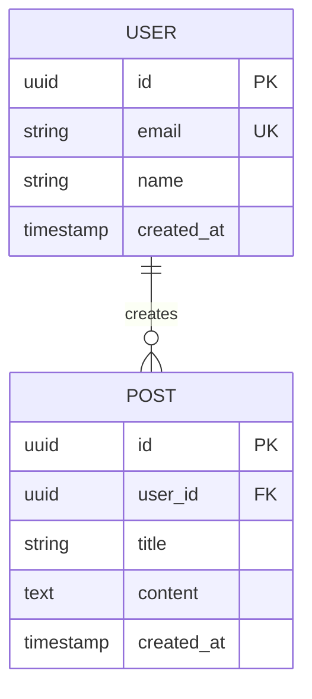

# AI Agent Configuration - Documentation System

This document provides specific guidelines for AI agents working on the **documentation** part of this project.

## 🎯 Documentation Overview

The `docs/` folder contains a **universal requirements documentation system** for specification-driven development:

- **Purpose**: Define comprehensive requirements before implementation
- **Approach**: Specification-driven development
- **Output**: Clear requirements that guide AI-assisted implementation
- **Scope**: Works for any type of software project

## 📁 Documentation Structure

```
docs/
├── GETTING-STARTED.md          # Complete walkthrough
├── PROMPTS.md                  # AI prompts for each phase
├── STRUCTURE.md                # Documentation organization
│
├── project-requirements/       # ⚠️ USER FILLS: Core requirements
│   ├── product-brief.md       # Product overview & goals
│   ├── srs.md                 # Software Requirements Specification
│   ├── database-design.md     # DB schema, ER diagrams
│   ├── api-specification.md   # API endpoints & contracts
│   ├── system-architecture.md # Architecture diagrams
│   └── user-stories.md        # User stories & acceptance criteria
│
├── design-specs/              # ⚠️ USER FILLS: Design specs (frontend)
│   ├── design-system.md      # Colors, typography, components
│   ├── wireframes/           # Wireframes & mockups
│   └── ui-specifications/    # Detailed UI specs per page
│
└── generated/                 # 🤖 AI CREATES: From specs
    ├── TECHNICAL_DOCS.md     # Consolidated technical docs
    ├── DATABASE_SCHEMA.sql   # Generated database schema
    ├── API_CONTRACTS.yaml    # OpenAPI/Swagger specs
    └── tasks.md              # Build checklist
```

## 🚨 Critical Documentation Rules

### 1. User-Filled vs AI-Generated
**NEVER** auto-generate user requirements without explicit approval:

```
✅ User Should Fill:
- project-requirements/*.md
- design-specs/*.md
- wireframes/

🤖 AI Should Generate:
- generated/TECHNICAL_DOCS.md
- generated/DATABASE_SCHEMA.sql
- generated/API_CONTRACTS.yaml
- generated/tasks.md
```

### 2. Requirements Quality Standards
Requirements must be:
- **Specific**: Exact measurements, data types, constraints
- **Complete**: All functional and non-functional requirements
- **Testable**: Clear acceptance criteria
- **Consistent**: No contradictions
- **Feasible**: Technically achievable

### 3. Database Design Standards
```markdown
✅ Good Database Design:
- Complete ER diagrams (entities, relationships, cardinality)
- Normalized schema (3NF minimum, BCNF preferred)
- All data types specified (VARCHAR(255), INTEGER, etc.)
- Primary keys, foreign keys, unique constraints defined
- Indexes for performance optimization
- Sample data for clarity

❌ Bad Database Design:
- Vague descriptions ("user data table")
- No relationships defined
- Missing data types
- No normalization
- No constraints
```

### 4. API Specification Standards
```markdown
✅ Good API Specification:
- All endpoints documented (method, path, parameters)
- Request/response formats with examples
- Authentication/authorization requirements
- Error responses with status codes
- Rate limiting and pagination
- Versioning strategy

❌ Bad API Specification:
- Missing endpoints
- No request/response examples
- Unclear authentication
- No error handling
```

## 📝 Documentation Workflow

### Phase 1: Requirements Gathering (User-Led)

**User fills out** (AI assists with formatting/structure):

1. **Product Brief** (`project-requirements/product-brief.md`)
   - What are you building?
   - Who is it for?
   - What problem does it solve?
   - Key features and goals

2. **SRS** (`project-requirements/srs.md`)
   - Functional requirements (what system must do)
   - Non-functional requirements (performance, security, etc.)
   - User roles and permissions
   - External interfaces

3. **Database Design** (`project-requirements/database-design.md`)
   - ER diagrams (use dbdiagram.io or similar)
   - Tables with columns and data types
   - Relationships and cardinality
   - Normalization analysis
   - Indexes and constraints

4. **API Specification** (`project-requirements/api-specification.md`)
   - All endpoints with methods
   - Request/response formats
   - Authentication flow
   - Error handling

5. **System Architecture** (`project-requirements/system-architecture.md`)
   - Architecture diagrams
   - Technology stack
   - Design patterns
   - Deployment strategy

6. **User Stories** (`project-requirements/user-stories.md`)
   - User stories with acceptance criteria
   - Priority (must-have, should-have, nice-to-have)
   - Estimates

**For Frontend Projects**, also fill out:

7. **Design System** (`design-specs/design-system.md`)
   - Color palette (hex codes)
   - Typography (fonts, sizes, weights)
   - Spacing system
   - Component library
   - Breakpoints

8. **Wireframes** (`design-specs/wireframes/`)
   - Page layouts
   - Component placement
   - User flows

9. **UI Specifications** (`design-specs/ui-specifications/`)
   - Detailed specs per page
   - Component behavior
   - Responsive rules
   - Accessibility requirements

### Phase 2: Documentation Generation (AI-Led)

**AI generates** based on user requirements:

1. **Technical Documentation** (`generated/TECHNICAL_DOCS.md`)
   - Consolidated technical specs
   - Architecture decisions
   - Technology rationale

2. **Database Schema** (`generated/DATABASE_SCHEMA.sql`)
   - SQL CREATE TABLE statements
   - Indexes and constraints
   - Sample data INSERT statements

3. **API Contracts** (`generated/API_CONTRACTS.yaml`)
   - OpenAPI/Swagger specification
   - Complete with all endpoints
   - Request/response schemas

4. **Build Checklist** (`generated/tasks.md`)
   - Ordered list of implementation tasks
   - Dependencies between tasks
   - Estimates

### Phase 3: Implementation (AI-Assisted)

Use generated documentation to guide implementation:
- Reference `generated/DATABASE_SCHEMA.sql` for migrations
- Reference `generated/API_CONTRACTS.yaml` for API implementation
- Reference `generated/tasks.md` for task order
- Reference `design-specs/` for frontend implementation

## 🎨 Documentation Formatting Standards

### Markdown Structure
```markdown
# Main Heading (H1) - Document Title

Brief introduction paragraph.

## Section Heading (H2)

Content for this section.

### Subsection (H3)

More detailed content.

#### Sub-subsection (H4)

Even more detail.

**Bold** for emphasis
*Italic* for terms
`code` for technical terms
```

### Tables
```markdown
| Column 1 | Column 2 | Column 3 |
|----------|----------|----------|
| Value 1  | Value 2  | Value 3  |
| Value 4  | Value 5  | Value 6  |
```

### Code Blocks
````markdown
```typescript
// Code example
const example = 'value';
```

```sql
-- SQL example
CREATE TABLE users (
  id UUID PRIMARY KEY,
  email VARCHAR(255) UNIQUE NOT NULL
);
```
````

### Lists
```markdown
**Ordered List:**
1. First item
2. Second item
3. Third item

**Unordered List:**
- First item
- Second item
- Third item

**Checklist:**
- [ ] Incomplete task
- [x] Completed task
```

## 🗄️ Database Design Guidelines

### ER Diagram Format
Use Mermaid or dbdiagram.io syntax:

```markdown
## ER Diagram


```

### Table Specifications
```markdown
### Users Table

| Column      | Type         | Constraints                    | Description          |
|-------------|--------------|--------------------------------|----------------------|
| id          | UUID         | PRIMARY KEY                    | Unique identifier    |
| email       | VARCHAR(255) | UNIQUE, NOT NULL               | User email           |
| name        | VARCHAR(100) | NULL                           | User full name       |
| password    | VARCHAR(255) | NOT NULL                       | Hashed password      |
| created_at  | TIMESTAMP    | NOT NULL, DEFAULT CURRENT_TIME | Creation timestamp   |
| updated_at  | TIMESTAMP    | NOT NULL, DEFAULT CURRENT_TIME | Last update          |

**Indexes:**
- `idx_users_email` on `email` (for login queries)
- `idx_users_created_at` on `created_at` (for sorting)

**Relationships:**
- One user can have many posts (1:N)
- One user can have one profile (1:1)
```

### Normalization Documentation
```markdown
## Normalization Analysis

### 1NF (First Normal Form)
- ✅ All columns contain atomic values
- ✅ No repeating groups
- ✅ Each row is unique

### 2NF (Second Normal Form)
- ✅ Meets 1NF
- ✅ No partial dependencies
- ✅ All non-key attributes depend on entire primary key

### 3NF (Third Normal Form)
- ✅ Meets 2NF
- ✅ No transitive dependencies
- ✅ All attributes depend only on primary key

### BCNF (Boyce-Codd Normal Form)
- ✅ Meets 3NF
- ✅ Every determinant is a candidate key
```

## 🌐 API Specification Guidelines

### Endpoint Documentation
```markdown
### Create User

**Endpoint:** `POST /api/users`

**Authentication:** Required (Bearer token)

**Request Body:**
```json
{
  "email": "user@example.com",
  "password": "password123",
  "name": "John Doe"
}
```

**Response (201 Created):**
```json
{
  "id": "550e8400-e29b-41d4-a716-446655440000",
  "email": "user@example.com",
  "name": "John Doe",
  "createdAt": "2024-01-01T00:00:00Z"
}
```

**Error Responses:**

**400 Bad Request:**
```json
{
  "error": "Validation failed",
  "details": [
    {
      "field": "email",
      "message": "Invalid email format"
    }
  ]
}
```

**409 Conflict:**
```json
{
  "error": "Email already exists"
}
```

**Rate Limiting:** 100 requests per minute per IP
```

## 🎨 Design System Guidelines

### Color Palette
```markdown
## Color Palette

### Primary Colors
- **Primary**: `#3B82F6` (Blue 500)
  - Light: `#60A5FA` (Blue 400)
  - Dark: `#2563EB` (Blue 600)

### Secondary Colors
- **Secondary**: `#8B5CF6` (Purple 500)
  - Light: `#A78BFA` (Purple 400)
  - Dark: `#7C3AED` (Purple 600)

### Neutral Colors
- **Gray 50**: `#F9FAFB`
- **Gray 100**: `#F3F4F6`
- **Gray 900**: `#111827`

### Semantic Colors
- **Success**: `#10B981` (Green 500)
- **Warning**: `#F59E0B` (Amber 500)
- **Error**: `#EF4444` (Red 500)
- **Info**: `#3B82F6` (Blue 500)
```

### Typography
```markdown
## Typography

### Font Families
- **Primary**: Inter, system-ui, sans-serif
- **Monospace**: 'Fira Code', monospace

### Font Sizes
| Name      | Size   | Line Height | Usage              |
|-----------|--------|-------------|--------------------|
| xs        | 12px   | 16px        | Captions, labels   |
| sm        | 14px   | 20px        | Body text (small)  |
| base      | 16px   | 24px        | Body text          |
| lg        | 18px   | 28px        | Large body text    |
| xl        | 20px   | 28px        | Subheadings        |
| 2xl       | 24px   | 32px        | Headings           |
| 3xl       | 30px   | 36px        | Large headings     |
| 4xl       | 36px   | 40px        | Hero text          |

### Font Weights
- **Regular**: 400
- **Medium**: 500
- **Semibold**: 600
- **Bold**: 700
```

## ✅ Documentation Quality Checklist

Before considering requirements complete:

### Product Brief
- [ ] Clear product description
- [ ] Target audience defined
- [ ] Business goals specified
- [ ] Key features listed
- [ ] Success metrics defined

### SRS
- [ ] All functional requirements documented
- [ ] Non-functional requirements specified
- [ ] User roles and permissions defined
- [ ] External interfaces documented
- [ ] Constraints and assumptions listed

### Database Design
- [ ] Complete ER diagram
- [ ] All tables with columns and types
- [ ] Relationships with cardinality
- [ ] Normalization analysis (3NF minimum)
- [ ] Indexes defined
- [ ] Constraints specified
- [ ] Sample data provided

### API Specification
- [ ] All endpoints documented
- [ ] Request/response formats with examples
- [ ] Authentication requirements
- [ ] Error responses defined
- [ ] Rate limiting specified
- [ ] Versioning strategy

### System Architecture
- [ ] Architecture diagrams
- [ ] Technology stack justified
- [ ] Design patterns documented
- [ ] Deployment strategy defined
- [ ] Security architecture

### User Stories
- [ ] All user stories written
- [ ] Acceptance criteria defined
- [ ] Priorities assigned
- [ ] Estimates provided

### Design System (Frontend)
- [ ] Color palette with hex codes
- [ ] Typography system complete
- [ ] Spacing system defined
- [ ] Component library documented
- [ ] Responsive breakpoints

### Wireframes (Frontend)
- [ ] All pages wireframed
- [ ] User flows documented
- [ ] Mobile and desktop versions

### UI Specifications (Frontend)
- [ ] Detailed specs per page
- [ ] Component behavior defined
- [ ] Responsive rules documented
- [ ] Accessibility requirements

## 🤖 AI Prompts for Documentation

### Generating Technical Documentation
```
Based on the requirements in docs/project-requirements/, generate:
1. Consolidated technical documentation
2. Architecture decision records
3. Technology stack rationale

Output to: docs/generated/TECHNICAL_DOCS.md
```

### Generating Database Schema
```
Based on the ER diagram and table specifications in 
docs/project-requirements/database-design.md, generate:
1. SQL CREATE TABLE statements
2. Indexes and constraints
3. Sample INSERT statements

Output to: docs/generated/DATABASE_SCHEMA.sql
```

### Generating API Contracts
```
Based on the API specification in 
docs/project-requirements/api-specification.md, generate:
1. Complete OpenAPI 3.0 specification
2. All endpoints with request/response schemas
3. Authentication and error schemas

Output to: docs/generated/API_CONTRACTS.yaml
```

### Generating Build Checklist
```
Based on all requirements in docs/project-requirements/ and 
docs/design-specs/, generate:
1. Ordered list of implementation tasks
2. Task dependencies
3. Estimates for each task

Output to: docs/generated/tasks.md
```

## 📚 Resources

### Requirements Engineering
- [IEEE SRS Template](https://standards.ieee.org/standard/830-1998.html)
- [User Story Mapping](https://jpattonassociates.com)

### Database Design
- [dbdiagram.io](https://dbdiagram.io) - ER diagram tool
- [Database Normalization](https://en.wikipedia.org/wiki/Database_normalization)

### API Design
- [OpenAPI Specification](https://swagger.io/specification/)
- [REST API Best Practices](https://restfulapi.net)

### Architecture
- [C4 Model](https://c4model.com) - Architecture diagrams
- [12-Factor App](https://12factor.net) - Best practices

### Design
- [Figma](https://figma.com) - Design tool
- [Tailwind CSS](https://tailwindcss.com) - CSS framework

## 🆘 Common Documentation Issues

### Vague Requirements
```markdown
❌ Bad: "The system should be fast"
✅ Good: "API responses must be under 200ms for 95th percentile"

❌ Bad: "Store user data"
✅ Good: "Store user data in PostgreSQL with the following schema..."
```

### Missing Relationships
```markdown
❌ Bad: Just listing tables
✅ Good: ER diagram showing all relationships with cardinality
```

### Incomplete API Specs
```markdown
❌ Bad: "POST /users - creates a user"
✅ Good: Complete endpoint with request/response examples, errors, auth
```

### No Acceptance Criteria
```markdown
❌ Bad: "As a user, I want to sign in"
✅ Good: "As a user, I want to sign in so that I can access my account
         Acceptance Criteria:
         - User can enter email and password
         - System validates credentials
         - User is redirected to dashboard on success
         - Error message shown on failure"
```

## 🎯 Success Criteria

Documentation is complete when:
- ✅ All requirements are specific and testable
- ✅ Database is fully designed and normalized
- ✅ All API endpoints are documented
- ✅ Architecture is clearly defined
- ✅ User stories have acceptance criteria
- ✅ Design system is complete (if frontend)
- ✅ AI can generate implementation code from specs
- ✅ No ambiguities or contradictions

---

**Remember**: Good documentation is the foundation of successful implementation. Be specific, complete, and clear. The time invested in requirements pays off exponentially during implementation.

