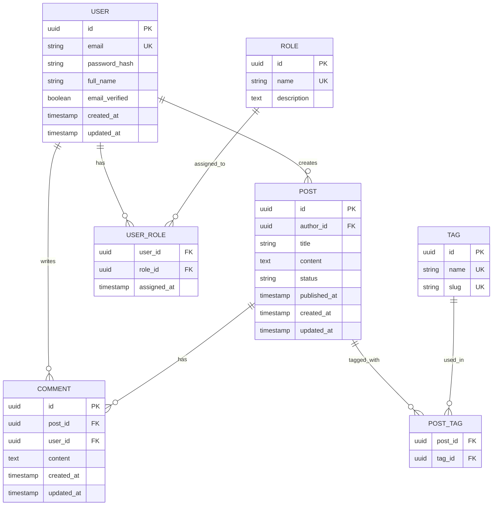

# Database Design

> **INSTRUCTIONS**: This document defines your complete data model. Include ER diagrams, table schemas, relationships, normalization decisions, and indexes. Skip this file if your project doesn't need a database.

---

## 1. Overview

### 1.1 Database Type

Select your database type:
- [ ] **Relational** (PostgreSQL, MySQL, etc.)
- [ ] **NoSQL** (MongoDB, DynamoDB, etc.)
- [ ] **Hybrid** (Both relational and NoSQL)

**Chosen**: [Your choice]

**Justification**: [Why this database type?]

Example: "PostgreSQL chosen for ACID compliance, complex queries, and strong support for JSON data types when needed."

### 1.2 Database Goals

What are the key requirements for your database?

- [ ] **Data Integrity**: Ensure referential integrity and data consistency
- [ ] **Performance**: Fast queries for [specific use cases]
- [ ] **Scalability**: Handle [X] records and [Y] concurrent connections
- [ ] **Flexibility**: Support for [specific features]

---

## 2. Entity-Relationship Diagram

### 2.1 ER Diagram

<!-- Use Mermaid, dbdiagram.io, or paste an image -->



**Alternative**: Upload an image from dbdiagram.io or draw.io


### 2.2 Diagram Legend

| Symbol | Meaning |
|--------|---------|
| `||--o{` | One-to-Many relationship |
| `||--||` | One-to-One relationship |
| `}o--o{` | Many-to-Many relationship |
| PK | Primary Key |
| FK | Foreign Key |
| UK | Unique Key |

---

## 3. Table Schemas

### 3.1 Users Table

**Table Name**: `users`

**Purpose**: Store user account information

| Column | Type | Constraints | Description |
|--------|------|-------------|-------------|
| id | UUID | PRIMARY KEY, DEFAULT gen_random_uuid() | Unique user identifier |
| email | VARCHAR(255) | NOT NULL, UNIQUE | User email address |
| password_hash | VARCHAR(255) | NOT NULL | Bcrypt hashed password |
| full_name | VARCHAR(100) | NOT NULL | User's full name |
| email_verified | BOOLEAN | DEFAULT FALSE | Email verification status |
| created_at | TIMESTAMP | DEFAULT CURRENT_TIMESTAMP | Account creation time |
| updated_at | TIMESTAMP | DEFAULT CURRENT_TIMESTAMP | Last update time |

**Indexes**:
- PRIMARY KEY on `id` (automatic)
- UNIQUE INDEX on `email`
- INDEX on `email_verified` (for filtering unverified users)
- INDEX on `created_at` (for sorting/pagination)

**Constraints**:
- `email` must be valid email format (check constraint or application-level)
- `password_hash` must be bcrypt format (application-level)
- `full_name` must be 2-100 characters (check constraint)

**Sample Data**:
```sql
INSERT INTO users (id, email, password_hash, full_name, email_verified)
VALUES 
  ('a0eebc99-9c0b-4ef8-bb6d-6bb9bd380a11', 'john@example.com', '$2b$12$...', 'John Doe', true),
  ('b1eebc99-9c0b-4ef8-bb6d-6bb9bd380a22', 'jane@example.com', '$2b$12$...', 'Jane Smith', true);
```

---

### 3.2 Posts Table

**Table Name**: `posts`

**Purpose**: Store blog posts or articles

| Column | Type | Constraints | Description |
|--------|------|-------------|-------------|
| id | UUID | PRIMARY KEY, DEFAULT gen_random_uuid() | Unique post identifier |
| author_id | UUID | NOT NULL, FOREIGN KEY → users(id) | Post author |
| title | VARCHAR(200) | NOT NULL | Post title |
| content | TEXT | NOT NULL | Post content (Markdown or HTML) |
| status | VARCHAR(20) | NOT NULL, DEFAULT 'draft' | Post status (draft, published, archived) |
| published_at | TIMESTAMP | NULL | Publication timestamp |
| created_at | TIMESTAMP | DEFAULT CURRENT_TIMESTAMP | Creation time |
| updated_at | TIMESTAMP | DEFAULT CURRENT_TIMESTAMP | Last update time |

**Indexes**:
- PRIMARY KEY on `id`
- INDEX on `author_id` (for user's posts)
- INDEX on `status` (for filtering by status)
- INDEX on `published_at DESC` (for sorting published posts)
- COMPOSITE INDEX on `(status, published_at DESC)` (for published posts query)

**Foreign Keys**:
- `author_id` REFERENCES `users(id)` ON DELETE CASCADE

**Constraints**:
- CHECK `status` IN ('draft', 'published', 'archived')
- CHECK `published_at` IS NULL when `status` = 'draft'
- CHECK `title` length >= 5 characters

**Sample Data**:
```sql
INSERT INTO posts (id, author_id, title, content, status, published_at)
VALUES 
  ('c2eebc99-9c0b-4ef8-bb6d-6bb9bd380a33', 'a0eebc99-9c0b-4ef8-bb6d-6bb9bd380a11', 
   'My First Post', 'This is the content...', 'published', '2026-01-01 10:00:00');
```

---

### 3.3 Comments Table

**Table Name**: `comments`

**Purpose**: Store user comments on posts

| Column | Type | Constraints | Description |
|--------|------|-------------|-------------|
| id | UUID | PRIMARY KEY, DEFAULT gen_random_uuid() | Unique comment identifier |
| post_id | UUID | NOT NULL, FOREIGN KEY → posts(id) | Associated post |
| user_id | UUID | NOT NULL, FOREIGN KEY → users(id) | Comment author |
| content | TEXT | NOT NULL | Comment content |
| created_at | TIMESTAMP | DEFAULT CURRENT_TIMESTAMP | Creation time |
| updated_at | TIMESTAMP | DEFAULT CURRENT_TIMESTAMP | Last update time |

**Indexes**:
- PRIMARY KEY on `id`
- INDEX on `post_id` (for post's comments)
- INDEX on `user_id` (for user's comments)
- INDEX on `created_at DESC` (for sorting)

**Foreign Keys**:
- `post_id` REFERENCES `posts(id)` ON DELETE CASCADE
- `user_id` REFERENCES `users(id)` ON DELETE CASCADE

**Constraints**:
- CHECK `content` length >= 1 character

---

### 3.4 Roles Table

**Table Name**: `roles`

**Purpose**: Define user roles (admin, moderator, user, etc.)

| Column | Type | Constraints | Description |
|--------|------|-------------|-------------|
| id | UUID | PRIMARY KEY, DEFAULT gen_random_uuid() | Unique role identifier |
| name | VARCHAR(50) | NOT NULL, UNIQUE | Role name |
| description | TEXT | NULL | Role description |

**Indexes**:
- PRIMARY KEY on `id`
- UNIQUE INDEX on `name`

**Sample Data**:
```sql
INSERT INTO roles (id, name, description)
VALUES 
  ('d3eebc99-9c0b-4ef8-bb6d-6bb9bd380a44', 'admin', 'Full system access'),
  ('e4eebc99-9c0b-4ef8-bb6d-6bb9bd380a55', 'moderator', 'Can moderate content'),
  ('f5eebc99-9c0b-4ef8-bb6d-6bb9bd380a66', 'user', 'Standard user');
```

---

### 3.5 User_Roles Table (Junction Table)

**Table Name**: `user_roles`

**Purpose**: Many-to-many relationship between users and roles

| Column | Type | Constraints | Description |
|--------|------|-------------|-------------|
| user_id | UUID | NOT NULL, FOREIGN KEY → users(id) | User identifier |
| role_id | UUID | NOT NULL, FOREIGN KEY → roles(id) | Role identifier |
| assigned_at | TIMESTAMP | DEFAULT CURRENT_TIMESTAMP | Assignment time |

**Indexes**:
- COMPOSITE PRIMARY KEY on `(user_id, role_id)`
- INDEX on `role_id` (for finding users with a role)

**Foreign Keys**:
- `user_id` REFERENCES `users(id)` ON DELETE CASCADE
- `role_id` REFERENCES `roles(id)` ON DELETE CASCADE

---

### 3.6 Tags Table

**Table Name**: `tags`

**Purpose**: Store content tags

| Column | Type | Constraints | Description |
|--------|------|-------------|-------------|
| id | UUID | PRIMARY KEY, DEFAULT gen_random_uuid() | Unique tag identifier |
| name | VARCHAR(50) | NOT NULL, UNIQUE | Tag name |
| slug | VARCHAR(50) | NOT NULL, UNIQUE | URL-friendly slug |

**Indexes**:
- PRIMARY KEY on `id`
- UNIQUE INDEX on `name`
- UNIQUE INDEX on `slug`

---

### 3.7 Post_Tags Table (Junction Table)

**Table Name**: `post_tags`

**Purpose**: Many-to-many relationship between posts and tags

| Column | Type | Constraints | Description |
|--------|------|-------------|-------------|
| post_id | UUID | NOT NULL, FOREIGN KEY → posts(id) | Post identifier |
| tag_id | UUID | NOT NULL, FOREIGN KEY → tags(id) | Tag identifier |

**Indexes**:
- COMPOSITE PRIMARY KEY on `(post_id, tag_id)`
- INDEX on `tag_id` (for finding posts with a tag)

**Foreign Keys**:
- `post_id` REFERENCES `posts(id)` ON DELETE CASCADE
- `tag_id` REFERENCES `tags(id)` ON DELETE CASCADE

---

<!-- Continue for all your tables... -->

---

## 4. Relationships

### 4.1 One-to-Many Relationships

| Parent Table | Child Table | Relationship | On Delete |
|--------------|-------------|--------------|-----------|
| users | posts | One user has many posts | CASCADE |
| users | comments | One user has many comments | CASCADE |
| posts | comments | One post has many comments | CASCADE |

**Explanation**:
- When a user is deleted, all their posts and comments are deleted (CASCADE)
- When a post is deleted, all its comments are deleted (CASCADE)

### 4.2 Many-to-Many Relationships

| Table 1 | Junction Table | Table 2 | Description |
|---------|----------------|---------|-------------|
| users | user_roles | roles | Users can have multiple roles |
| posts | post_tags | tags | Posts can have multiple tags |

**Explanation**:
- A user can have multiple roles (admin, moderator)
- A role can be assigned to multiple users
- A post can have multiple tags
- A tag can be used on multiple posts

### 4.3 One-to-One Relationships

<!-- If you have any one-to-one relationships -->

| Table 1 | Table 2 | Description |
|---------|---------|-------------|
| users | user_profiles | Each user has one profile |

---

## 5. Normalization

### 5.1 Normal Forms Achieved

- [x] **1NF (First Normal Form)**: All columns contain atomic values
- [x] **2NF (Second Normal Form)**: No partial dependencies on composite keys
- [x] **3NF (Third Normal Form)**: No transitive dependencies
- [x] **BCNF (Boyce-Codd Normal Form)**: Every determinant is a candidate key

### 5.2 Normalization Decisions

**Example 1: Separating User Roles**

❌ **Before (Not Normalized)**:
```
users table:
- id
- email
- roles (comma-separated string: "admin,moderator")
```

✅ **After (Normalized)**:
```
users table:
- id
- email

roles table:
- id
- name

user_roles table (junction):
- user_id
- role_id
```

**Reason**: Allows querying users by role, adding/removing roles easily, and maintaining data integrity.

---

**Example 2: Separating Tags**

❌ **Before**:
```
posts table:
- id
- title
- tags (JSON array: ["javascript", "nodejs"])
```

✅ **After**:
```
posts table:
- id
- title

tags table:
- id
- name

post_tags table:
- post_id
- tag_id
```

**Reason**: Allows querying posts by tag, prevents duplicate tag names, and enables tag management.

---

### 5.3 Denormalization Decisions

Sometimes we intentionally denormalize for performance:

**Example: Caching Comment Count**

```
posts table:
- id
- title
- comment_count (denormalized)
```

**Reason**: Frequently displayed, expensive to calculate, updated via trigger/application logic.

**Trade-off**: Slight data redundancy for significant performance gain.

---

## 6. Indexes

### 6.1 Index Strategy

| Table | Index | Type | Purpose |
|-------|-------|------|---------|
| users | email | UNIQUE | Login lookup |
| users | created_at | B-tree | Sorting/pagination |
| posts | author_id | B-tree | User's posts |
| posts | (status, published_at) | Composite | Published posts query |
| comments | post_id | B-tree | Post's comments |
| comments | user_id | B-tree | User's comments |

### 6.2 Query Optimization

**Common Query 1**: Get published posts with author info
```sql
SELECT p.*, u.full_name 
FROM posts p
JOIN users u ON p.author_id = u.id
WHERE p.status = 'published'
ORDER BY p.published_at DESC
LIMIT 20;
```

**Indexes Used**:
- Composite index on `posts(status, published_at DESC)`
- Primary key on `users(id)`

---

**Common Query 2**: Get user's posts with comment count
```sql
SELECT p.*, COUNT(c.id) as comment_count
FROM posts p
LEFT JOIN comments c ON p.post_id = c.post_id
WHERE p.author_id = ?
GROUP BY p.id
ORDER BY p.created_at DESC;
```

**Indexes Used**:
- Index on `posts(author_id)`
- Index on `comments(post_id)`

---

## 7. Constraints & Validation

### 7.1 Check Constraints

```sql
-- Post status must be valid
ALTER TABLE posts 
ADD CONSTRAINT check_post_status 
CHECK (status IN ('draft', 'published', 'archived'));

-- Email format (PostgreSQL)
ALTER TABLE users
ADD CONSTRAINT check_email_format
CHECK (email ~* '^[A-Za-z0-9._%+-]+@[A-Za-z0-9.-]+\.[A-Z|a-z]{2,}$');

-- Name length
ALTER TABLE users
ADD CONSTRAINT check_name_length
CHECK (LENGTH(full_name) >= 2 AND LENGTH(full_name) <= 100);
```

### 7.2 Foreign Key Constraints

All foreign keys defined with appropriate ON DELETE behavior:
- **CASCADE**: Delete child records when parent is deleted
- **SET NULL**: Set foreign key to NULL when parent is deleted
- **RESTRICT**: Prevent deletion of parent if children exist

### 7.3 Unique Constraints

- `users.email` - Prevent duplicate emails
- `roles.name` - Prevent duplicate role names
- `tags.name` - Prevent duplicate tag names
- `tags.slug` - Prevent duplicate slugs

---

## 8. Database Schema SQL

### 8.1 Complete Schema

```sql
-- Enable UUID extension (PostgreSQL)
CREATE EXTENSION IF NOT EXISTS "uuid-ossp";

-- Users table
CREATE TABLE users (
    id UUID PRIMARY KEY DEFAULT gen_random_uuid(),
    email VARCHAR(255) NOT NULL UNIQUE,
    password_hash VARCHAR(255) NOT NULL,
    full_name VARCHAR(100) NOT NULL,
    email_verified BOOLEAN DEFAULT FALSE,
    created_at TIMESTAMP DEFAULT CURRENT_TIMESTAMP,
    updated_at TIMESTAMP DEFAULT CURRENT_TIMESTAMP,
    CONSTRAINT check_email_format CHECK (email ~* '^[A-Za-z0-9._%+-]+@[A-Za-z0-9.-]+\.[A-Z|a-z]{2,}$'),
    CONSTRAINT check_name_length CHECK (LENGTH(full_name) >= 2 AND LENGTH(full_name) <= 100)
);

CREATE INDEX idx_users_email_verified ON users(email_verified);
CREATE INDEX idx_users_created_at ON users(created_at);

-- Posts table
CREATE TABLE posts (
    id UUID PRIMARY KEY DEFAULT gen_random_uuid(),
    author_id UUID NOT NULL REFERENCES users(id) ON DELETE CASCADE,
    title VARCHAR(200) NOT NULL,
    content TEXT NOT NULL,
    status VARCHAR(20) NOT NULL DEFAULT 'draft',
    published_at TIMESTAMP NULL,
    created_at TIMESTAMP DEFAULT CURRENT_TIMESTAMP,
    updated_at TIMESTAMP DEFAULT CURRENT_TIMESTAMP,
    CONSTRAINT check_post_status CHECK (status IN ('draft', 'published', 'archived')),
    CONSTRAINT check_title_length CHECK (LENGTH(title) >= 5)
);

CREATE INDEX idx_posts_author_id ON posts(author_id);
CREATE INDEX idx_posts_status ON posts(status);
CREATE INDEX idx_posts_published_at ON posts(published_at DESC);
CREATE INDEX idx_posts_status_published_at ON posts(status, published_at DESC);

-- Comments table
CREATE TABLE comments (
    id UUID PRIMARY KEY DEFAULT gen_random_uuid(),
    post_id UUID NOT NULL REFERENCES posts(id) ON DELETE CASCADE,
    user_id UUID NOT NULL REFERENCES users(id) ON DELETE CASCADE,
    content TEXT NOT NULL,
    created_at TIMESTAMP DEFAULT CURRENT_TIMESTAMP,
    updated_at TIMESTAMP DEFAULT CURRENT_TIMESTAMP,
    CONSTRAINT check_content_length CHECK (LENGTH(content) >= 1)
);

CREATE INDEX idx_comments_post_id ON comments(post_id);
CREATE INDEX idx_comments_user_id ON comments(user_id);
CREATE INDEX idx_comments_created_at ON comments(created_at DESC);

-- Roles table
CREATE TABLE roles (
    id UUID PRIMARY KEY DEFAULT gen_random_uuid(),
    name VARCHAR(50) NOT NULL UNIQUE,
    description TEXT NULL
);

-- User_Roles junction table
CREATE TABLE user_roles (
    user_id UUID NOT NULL REFERENCES users(id) ON DELETE CASCADE,
    role_id UUID NOT NULL REFERENCES roles(id) ON DELETE CASCADE,
    assigned_at TIMESTAMP DEFAULT CURRENT_TIMESTAMP,
    PRIMARY KEY (user_id, role_id)
);

CREATE INDEX idx_user_roles_role_id ON user_roles(role_id);

-- Tags table
CREATE TABLE tags (
    id UUID PRIMARY KEY DEFAULT gen_random_uuid(),
    name VARCHAR(50) NOT NULL UNIQUE,
    slug VARCHAR(50) NOT NULL UNIQUE
);

-- Post_Tags junction table
CREATE TABLE post_tags (
    post_id UUID NOT NULL REFERENCES posts(id) ON DELETE CASCADE,
    tag_id UUID NOT NULL REFERENCES tags(id) ON DELETE CASCADE,
    PRIMARY KEY (post_id, tag_id)
);

CREATE INDEX idx_post_tags_tag_id ON post_tags(tag_id);
```

### 8.2 Seed Data

```sql
-- Insert default roles
INSERT INTO roles (name, description) VALUES
  ('admin', 'Full system access'),
  ('moderator', 'Can moderate content'),
  ('user', 'Standard user');

-- Insert sample tags
INSERT INTO tags (name, slug) VALUES
  ('JavaScript', 'javascript'),
  ('Node.js', 'nodejs'),
  ('PostgreSQL', 'postgresql');
```

---

## 9. Migration Strategy

### 9.1 Initial Migration

```bash
# Create initial schema
psql -U postgres -d mydb -f schema.sql

# Run seed data
psql -U postgres -d mydb -f seed.sql
```

### 9.2 Future Migrations

Use migration tool (e.g., TypeORM, Prisma, Flyway):

```
migrations/
├── 001_initial_schema.sql
├── 002_add_user_profiles.sql
├── 003_add_post_views_count.sql
```

---

## 10. Backup & Recovery

### 10.1 Backup Strategy

- **Frequency**: Daily automated backups
- **Retention**: 30 days
- **Method**: pg_dump for PostgreSQL
- **Storage**: Encrypted S3 bucket

### 10.2 Recovery Plan

```bash
# Restore from backup
psql -U postgres -d mydb < backup_2026-01-05.sql
```

---

## ✅ Completion Checklist

Before moving to the next document:

- [ ] ER diagram is complete and accurate
- [ ] All tables are defined with proper data types
- [ ] All relationships are documented (1:1, 1:N, N:M)
- [ ] Foreign keys are defined with ON DELETE behavior
- [ ] Indexes are planned for common queries
- [ ] Database is normalized to at least 3NF
- [ ] Constraints are defined (CHECK, UNIQUE, NOT NULL)
- [ ] Sample data is provided for reference
- [ ] Complete schema SQL is ready

---

**Next Steps**:

1. **If you have an API**: Fill out `api-specification.md`
2. **Continue to**: `system-architecture.md`
3. **Generate schema**: Use AI to convert this to actual SQL migrations

