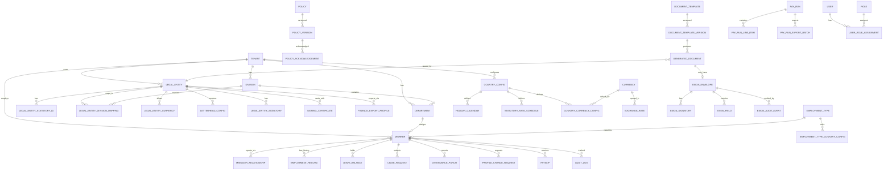

# Polaris — Database Design

**Product:** Polaris  
**Status:** Approved for implementation  
**Last updated:** 10 August 2026  
**Companion to:** [prd.md](./prd.md) §6.14 · §10 · [system-architecture.md](./system-architecture.md)

---

## 1. Overview

### 1.1 Database type

**PostgreSQL 15+** on Azure Database for PostgreSQL (Flexible Server).

**Justification:** ACID compliance for payroll and leave balances; strong JSON support for dynamic benefit fields; mature TypeORM integration; append-only table enforcement via grants; point-in-time recovery.

### 1.2 Database goals

| Goal | Approach |
|---|---|
| Data integrity | Foreign keys, check constraints, TypeORM migrations |
| Performance | Indexes on `tenant_id`, `country_code`, `worker_id`, status fields, effective dates |
| Scalability | ~500 workers, ~10M audit rows over 5 years — single instance sufficient v1 |
| Multi-tenant readiness | `tenant_id` UUID on all core tables |
| Compliance | Append-only audit tables; 5-year retention; soft-delete not hard-delete |

### 1.3 Naming conventions

- Tables: `snake_case`, plural (`workers`, `leave_requests`)
- Primary keys: `id` UUID v4
- Foreign keys: `{entity}_id`
- Timestamps: `created_at`, `updated_at` (UTC)
- Soft delete: `deleted_at` nullable timestamp
- Effective dating: `effective_from`, `effective_to` (nullable = open-ended)

### 1.4 Multi-tenancy & scoping rules

Polaris is **tenant-first** in the data model. v1 runs a single Digitaro tenant, but every business table carries `tenant_id` so multi-tenant productization is a configuration change, not a schema rewrite.

#### Mandatory columns

| Column | Rule |
|---|---|
| **`tenant_id`** | **Required on every business table** except global ISO reference tables (`currency_codes`). NOT NULL, FK → `tenants(id)`. Denormalised on child tables even when parent FK exists — enables RLS and safe queries without joins. |
| **`legal_entity_id`** | Required on payroll, finance export, generated documents, payslips, contractor payment batches, and statutory rate schedules. Optional default on `workers` (resolved from country + division). Nullable on operational records (leave, attendance) unless tied to a pay run. |

#### Scoping hierarchy

```
tenants
  └── legal_entities          (employer of record — payroll, docs, finance)
  └── divisions / departments
  └── workers                 (+ default legal_entity_id)
        └── leave, attendance, expenses, …  (tenant_id; legal_entity_id when financial)
```

#### Query rule (enforced in repository layer + PostgreSQL RLS)

Every SELECT/UPDATE/DELETE MUST filter by `tenant_id = :currentTenantId` from the authenticated session. Never trust client-supplied tenant IDs without verification.

```sql
-- Example RLS policy (applied to all tenant-scoped tables)
CREATE POLICY tenant_isolation ON workers
  USING (tenant_id = current_setting('app.current_tenant_id')::uuid);
```

#### Global vs tenant-scoped reference data

| Table | Scope | Notes |
|---|---|---|
| `currency_codes` | **Global** | ISO 4217 master list (PKR, AED, SGD, USD…) — read-only seed |
| `tenant_currencies` | Tenant | Which currencies are enabled per tenant |
| `exchange_rates` | Tenant | Rate history; Frankfurter job writes per tenant |
| Everything else | **Tenant** | Includes roles, policies, templates, holidays, etc. |

#### Legal entity resolution

| Context | How `legal_entity_id` is set |
|---|---|
| Worker hire | Resolved from `legal_entity_division_mappings` (country + division); stored as default on worker |
| Document generation | Snapshot `legal_entity_id` on `generated_documents` at issue time |
| Pay run | Explicit on `pay_runs`; drives currency and export profile |
| Payslip / invoice | Copied from pay run or worker default at creation |
| Leave / attendance | `tenant_id` only — no legal entity unless exported to payroll |

#### Composite unique constraints

All unique constraints include `tenant_id`:

```sql
UNIQUE (tenant_id, code)           -- employment_types, leave_types, roles
UNIQUE (tenant_id, email)          -- workers
UNIQUE (tenant_id, worker_id, leave_type_id, as_of_date)  -- leave_balances
```

#### Child table pattern

Child tables **always** carry denormalised `tenant_id`:

```sql
-- ✅ Correct: tenant_id on child
leave_requests (id, tenant_id, worker_id, …)

-- ❌ Wrong: relying only on worker FK for tenant isolation
leave_requests (id, worker_id, …)  -- no direct tenant filter
```

Application layer validates `worker.tenant_id = leave_request.tenant_id` on insert.

### 1.5 Scoping matrix (all tables)

| Table | tenant_id | legal_entity_id | Notes |
|---|---|---|---|
| **Organisation** | | | |
| tenants | — | — | Root |
| divisions | ✅ | — | |
| departments | ✅ | — | |
| legal_entities | ✅ | — | Entity is tenant-owned |
| legal_entity_statutory_ids | ✅ | via FK | Denormalised tenant_id |
| legal_entity_division_mappings | ✅ | via FK | |
| legal_entity_currencies | ✅ | via FK | |
| letterhead_configs | ✅ | via FK | |
| legal_entity_signatories | ✅ | via FK | |
| signing_certificates | ✅ | via FK | |
| finance_export_profiles | ✅ | via FK | |
| office_locations | ✅ | — | Geofence hubs |
| **Workers** | | | |
| workers | ✅ | ✅ default | Default employer of record |
| employment_types | ✅ | — | |
| employment_type_country_configs | ✅ | — | |
| contractor_profiles | ✅ | — | |
| worker_statutory_ids | ✅ | — | Normalized country IDs + expiry (not JSONB on workers) |
| worker_bank_accounts | ✅ | — | Encrypted payroll bank details; Finance-redacted |
| profile_change_requests | ✅ | — | |
| manager_relationships | ✅ | — | |
| project_assignments | ✅ | — | |
| employment_records | ✅ | — | Career history |
| employee_skills | ✅ | — | |
| audit_log | ✅ | — | |
| **Time & leave** | | | |
| leave_types | ✅ | — | |
| leave_balances | ✅ | — | |
| leave_requests | ✅ | — | |
| comp_off_credits | ✅ | — | |
| holiday_calendars | ✅ | — | |
| holidays | ✅ | — | |
| company_closures | ✅ | — | |
| work_week_patterns | ✅ | — | |
| staff_calendar_days | ✅ | — | |
| attendance_punches | ✅ | — | |
| attendance_day_summaries | ✅ | — | |
| punch_correction_requests | ✅ | — | |
| shift_rosters | ✅ | — | |
| shift_assignments | ✅ | — | |
| **Documents & e-sign** | | | |
| policies | ✅ | — | |
| policy_versions | ✅ | — | |
| policy_acknowledgements | ✅ | — | |
| document_templates | ✅ | — | |
| document_template_versions | ✅ | — | |
| generated_documents | ✅ | ✅ | Snapshot at issue |
| esign_envelopes | ✅ | ✅ | |
| esign_signatories | ✅ | — | |
| esign_fields | ✅ | — | |
| esign_audit_events | ✅ | — | Append-only |
| **Payroll & finance** | | | |
| currency_codes | — | — | Global ISO reference |
| tenant_currencies | ✅ | — | Enabled currencies |
| exchange_rates | ✅ | — | |
| exchange_rate_fetch_batches | ✅ | — | |
| country_currency_configs | ✅ | — | |
| pay_components | ✅ | — | |
| compensation_records | ✅ | — | |
| benefit_types | ✅ | — | |
| benefit_type_fields | ✅ | — | |
| employee_benefits | ✅ | — | |
| statutory_rate_schedules | ✅ | ✅ | Per entity + country |
| statutory_rate_entries | ✅ | — | |
| pay_runs | ✅ | ✅ | |
| pay_run_line_items | ✅ | ✅ | |
| pay_run_export_batches | ✅ | ✅ | |
| payslips | ✅ | ✅ | |
| contractor_invoices | ✅ | ✅ | |
| contractor_invoice_line_items | ✅ | ✅ | |
| contractor_payment_batches | ✅ | ✅ | |
| contractor_payment_lines | ✅ | ✅ | |
| remittance_corridor_configs | ✅ | — | |
| remittance_packs | ✅ | — | pay_run_line + contractor_payment_line |
| remittance_pack_documents | ✅ | — | |
| **Operations & talent** | | | |
| expense_claims | ✅ | ✅ | Entity for finance export |
| expense_claim_lines | ✅ | — | |
| expense_policies | ✅ | — | |
| travel_requests | ✅ | — | |
| travel_itineraries | ✅ | — | |
| help_desk_tickets | ✅ | — | |
| ticket_comments | ✅ | — | |
| onboarding_templates | ✅ | — | |
| onboarding_cases | ✅ | — | was onboarding_instances |
| onboarding_tasks | ✅ | — | |
| separation_cases | ✅ | — | was separations |
| clearance_items | ✅ | — | was clearance_tasks |
| job_requisitions | ✅ | — | |
| candidates | ✅ | — | |
| pre_boarding_packets | ✅ | — | |
| pre_boarding_field_values | ✅ | — | |
| worker_passports | ✅ | — | AE/SG |
| worker_visa_records | ✅ | — | AE/SG previous + current |
| worker_visa_attachments | ✅ | — | |
| entra_provisioning_jobs | ✅ | — | |
| interview_scorecards | ✅ | — | |
| performance_cycles | ✅ | — | Assessment templates JSONB |
| performance_goals | ✅ | — | Soft-delete; optional KR link |
| goal_check_ins | ✅ | — | Mid-cycle progress |
| performance_reviews | ✅ | — | Assessment payloads; probation outcome |
| performance_review_peer_feedback | ✅ | — | Peer/upward rows |
| organizational_objectives | ✅ | — | Company/division/department OKRs |
| objective_key_results | ✅ | — | |
| feedback_entries | ✅ | — | Continuous feedback |
| recognition_entries | ✅ | — | |
| one_on_one_meetings | ✅ | — | |
| one_on_one_notes | ✅ | — | |
| development_plans | ✅ | — | IDPs |
| development_plan_actions | ✅ | — | |
| pulse_surveys | ✅ | — | |
| pulse_survey_responses | ✅ | — | |
| training_courses | ✅ | — | |
| training_assignments | ✅ | — | |
| training_completions | ✅ | — | |
| manpower_plans | ✅ | — | |
| manpower_positions | ✅ | — | |
| alert_rules | ✅ | — | |
| scheduled_report_subscriptions | ✅ | — | |
| compliance_alerts | ✅ | — | |
| **Auth & RBAC** | | | |
| users | ✅ | — | Better Auth + tenant link |
| roles | ✅ | — | |
| user_role_assignments | ✅ | — | |
| country_configs | ✅ | — | PK/UAE/SG settings per tenant |

---

## 2. Entity-relationship diagram (core)


```mermaid
erDiagram
    TENANT ||--o{ WORKER : employs
    TENANT ||--o{ DEPARTMENT : has
    TENANT ||--o{ DIVISION : has
    TENANT ||--o{ COUNTRY_CONFIG : configures
    TENANT ||--o{ LEGAL_ENTITY : owns

    LEGAL_ENTITY ||--o{ LEGAL_ENTITY_STATUTORY_ID : has
    LEGAL_ENTITY ||--o{ LEGAL_ENTITY_DIVISION_MAPPING : maps_to
    LEGAL_ENTITY ||--o{ LEGAL_ENTITY_CURRENCY : allows
    LEGAL_ENTITY ||--o{ LETTERHEAD_CONFIG : versions
    LEGAL_ENTITY ||--o{ LEGAL_ENTITY_SIGNATORY : has
    LEGAL_ENTITY ||--o{ SIGNING_CERTIFICATE : seals_with
    LEGAL_ENTITY ||--o{ FINANCE_EXPORT_PROFILE : exports_via
    DIVISION ||--o{ LEGAL_ENTITY_DIVISION_MAPPING : resolves

    DIVISION ||--o{ DEPARTMENT : contains
    DEPARTMENT ||--o{ WORKER : assigns
    WORKER ||--o{ MANAGER_RELATIONSHIP : reports_via
    WORKER ||--o{ EMPLOYMENT_RECORD : has_history
    WORKER ||--o{ LEAVE_BALANCE : holds
    WORKER ||--o{ LEAVE_REQUEST : submits
    WORKER ||--o{ ATTENDANCE_PUNCH : records
    WORKER ||--o{ PROFILE_CHANGE_REQUEST : requests

    EMPLOYMENT_TYPE ||--o{ WORKER : classifies
    EMPLOYMENT_TYPE ||--o{ EMPLOYMENT_TYPE_COUNTRY_CONFIG : rules

    COUNTRY_CONFIG ||--o{ HOLIDAY_CALENDAR : defines
    COUNTRY_CONFIG ||--o{ STATUTORY_RATE_SCHEDULE : defines
    COUNTRY_CONFIG ||--o{ COUNTRY_CURRENCY_CONFIG : defines

    CURRENCY ||--o{ EXCHANGE_RATE : quoted_in
    CURRENCY ||--o{ COUNTRY_CURRENCY_CONFIG : default_for

    POLICY ||--o{ POLICY_VERSION : versioned
    POLICY_VERSION ||--o{ POLICY_ACKNOWLEDGEMENT : acknowledged

    DOCUMENT_TEMPLATE ||--o{ DOCUMENT_TEMPLATE_VERSION : versioned
    DOCUMENT_TEMPLATE_VERSION ||--o{ GENERATED_DOCUMENT : produces
    GENERATED_DOCUMENT }o--|| LEGAL_ENTITY : issued_by
    GENERATED_DOCUMENT ||--o| ESIGN_ENVELOPE : may_have

    ESIGN_ENVELOPE ||--o{ ESIGN_SIGNATORY : has
    ESIGN_ENVELOPE ||--o{ ESIGN_FIELD : contains
    ESIGN_ENVELOPE ||--o{ ESIGN_AUDIT_EVENT : audited_by

    PAY_RUN ||--o{ PAY_RUN_LINE_ITEM : contains
    PAY_RUN ||--o{ PAY_RUN_EXPORT_BATCH : exports
    WORKER ||--o{ PAYSLIP : receives

    USER ||--o{ USER_ROLE_ASSIGNMENT : has
    ROLE ||--o{ USER_ROLE_ASSIGNMENT : assigned

    WORKER ||--o{ AUDIT_LOG : tracked
```

---

## 3. Core entities

### 3.1 Organisation & tenancy

#### `tenants`
| Column | Type | Notes |
|---|---|---|
| id | UUID PK | |
| name | VARCHAR(255) | "Digitaro" |
| slug | VARCHAR(100) UK | `digitaro` |
| base_reporting_currency | CHAR(3) FK | → currencies |
| created_at | TIMESTAMPTZ | |

#### `divisions`
| Column | Type | Notes |
|---|---|---|
| id | UUID PK | |
| tenant_id | UUID FK NOT NULL | |
| name | VARCHAR(100) | Labs, Studio |
| head_worker_id | UUID FK | Division Head |

#### `departments`
| Column | Type | Notes |
|---|---|---|
| id | UUID PK | |
| tenant_id | UUID FK NOT NULL | |
| division_id | UUID FK | |
| name | VARCHAR(100) | |
| parent_department_id | UUID FK | nullable, hierarchy |

#### `legal_entities`

Employer of record for payroll, document generation, and finance export. One tenant may have multiple entities (e.g. Digitaro Labs PK, Digitaro Studio UAE). Resolved for a worker by **country + division** unless explicitly overridden on a document (PRD §6.8.1).

| Column | Type | Notes |
|---|---|---|
| id | UUID PK | |
| tenant_id | UUID FK NOT NULL | |
| code | VARCHAR(50) UK per tenant | `DIGITARO_LABS_PK`, `DIGITARO_STUDIO_UAE` |
| registered_name | VARCHAR(255) NOT NULL | Legal name on contracts; merge field `{{legal_entity.registered_name}}` |
| trading_name | VARCHAR(255) | Display / letterhead name if different |
| country_code | CHAR(2) NOT NULL | PK, AE, SG — jurisdiction of incorporation |
| functional_currency | CHAR(3) FK NOT NULL | Accounting currency for pay runs & export packs (PRD §6.21.2) |
| status | ENUM | active, inactive |
| logo_blob_url | VARCHAR(500) | Company logo for letterhead (Azure Blob) |
| address_line_1 | VARCHAR(255) | Registered address |
| address_line_2 | VARCHAR(255) | nullable |
| city | VARCHAR(100) | |
| state_province | VARCHAR(100) | nullable — e.g. province for PK |
| postal_code | VARCHAR(20) | nullable |
| phone | VARCHAR(50) | |
| email | VARCHAR(255) | e.g. admin@digitaro.co |
| website | VARCHAR(255) | nullable |
| footer_text | TEXT | Confidentiality notice, legal disclaimers |
| page_numbering_enabled | BOOLEAN | default true |
| payroll_export_profile_id | UUID FK | nullable → `finance_export_profiles` |
| requires_wet_stamp | BOOLEAN | default false — manual-sign path shows stamp zone + checklist (PRD §6.8.1) |
| stamp_instructions | TEXT | nullable — entity-specific stamp guidance |
| default_render_profile | ENUM | `full_digital`, `print_on_letterhead` — default at export |
| effective_from | DATE NOT NULL | Entity config effective date |
| effective_to | DATE | nullable — open-ended if null |
| created_at | TIMESTAMPTZ | |
| updated_at | TIMESTAMPTZ | |
| created_by | UUID FK | audit |

**Indexes:** `(tenant_id, country_code, status)`, `(tenant_id, code)` UNIQUE

**Examples (Digitaro seed data):**

| code | registered_name | country | functional_currency |
|---|---|---|---|
| DIGITARO_LABS_PK | Digitaro Labs (Private) Limited | PK | PKR |
| DIGITARO_STUDIO_UAE | Digitaro Studio FZ-LLC | AE | AED |
| DIGITARO_SG | Digitaro Pte. Ltd. | SG | SGD |

#### `legal_entity_statutory_ids`

Country-conditional registration numbers — same pattern as `worker_statutory_ids`. Surfaced in letterhead and merge fields.

| Column | Type | Notes |
|---|---|---|
| id | UUID PK | |
| tenant_id | UUID FK NOT NULL | Denormalised for RLS |
| legal_entity_id | UUID FK NOT NULL | |
| field_key | VARCHAR(50) | Country-specific — see below |
| field_value | VARCHAR(255) | |
| expiry_date | DATE | nullable — e.g. trade licence renewal |

**Unique:** `(tenant_id, legal_entity_id, field_key)`

**Field keys by country:**

| Country | field_key examples |
|---|---|
| PK | `ntn`, `secp_registration`, `eobi_employer_number` |
| AE | `trade_licence_number`, `mohre_establishment_id`, `vat_trn` |
| SG | `uen`, `cpf_employer_ref`, `gst_registration` |

#### `legal_entity_division_mappings`

Resolves which legal entity applies when generating documents or pay runs for a worker. Letterhead resolved by worker's **country + division** (PRD §6.8.1).

| Column | Type | Notes |
|---|---|---|
| id | UUID PK | |
| tenant_id | UUID FK NOT NULL | Denormalised for RLS |
| legal_entity_id | UUID FK NOT NULL | |
| division_id | UUID FK | nullable — null = all divisions in country |
| country_code | CHAR(2) | PK, AE, SG |
| is_default | BOOLEAN | Fallback when multiple entities match |
| priority | INT | Lower = preferred when multiple match |
| effective_from | DATE | |
| effective_to | DATE | nullable |

**Unique constraint:** `(tenant_id, legal_entity_id, division_id, country_code, effective_from)`

#### `legal_entity_currencies`

Allowed transaction currencies per entity (PRD §6.21.2). Worker's compensation currency must appear in this list.

| Column | Type | Notes |
|---|---|---|
| id | UUID PK | |
| tenant_id | UUID FK NOT NULL | |
| legal_entity_id | UUID FK NOT NULL | |
| currency_code | CHAR(3) FK | → currency_codes |
| is_default | BOOLEAN | Default for new worker comp in this entity |
| is_active | BOOLEAN | Inactive = no new records; historical retained |

**Unique:** `(tenant_id, legal_entity_id, currency_code)`

#### `letterhead_configs`

Versioned letterhead layout separate from entity master data. Changes apply to **future generations only** — issued PDFs retain snapshot (PRD §6.8.1).

| Column | Type | Notes |
|---|---|---|
| id | UUID PK | |
| tenant_id | UUID FK NOT NULL | |
| legal_entity_id | UUID FK NOT NULL | |
| version | INT NOT NULL | Incremented on each save |
| layout_json | JSONB | Logo position, margins, header/footer blocks, font sizes |
| preview_blob_url | VARCHAR(500) | Cached preview PDF |
| is_current | BOOLEAN | Only one current per entity |
| effective_from | TIMESTAMPTZ | |
| created_by | UUID FK | |
| created_at | TIMESTAMPTZ | |

**Unique:** `(tenant_id, legal_entity_id, version)`

**layout_json structure (example):**

```json
{
  "logo": { "position": "top-left", "maxHeightPx": 48 },
  "header": { "showRegisteredName": true, "showTradingName": false, "showAddress": true },
  "footer": { "showPageNumbers": true, "customText": "Confidential — Digitaro internal" },
  "margins": { "top": 72, "bottom": 72, "left": 72, "right": 72 },
  "physicalStock": {
    "enabled": true,
    "contentTopMarginMm": 45,
    "contentBottomMarginMm": 25,
    "showPrintWatermark": true
  },
  "renderProfiles": {
    "print_on_letterhead": { "showHeader": false, "showFooterDocNumber": true, "showStampZone": "from_entity_config" },
    "full_digital": { "showHeader": true, "showSignatoryBlock": true },
    "informational": { "showHeader": true, "showNoSignatureBanner": true }
  }
}
```

#### `legal_entity_signatories`

Default company signatory block for HR documents and e-sign envelopes (PRD §6.8.1, §6.13).

| Column | Type | Notes |
|---|---|---|
| id | UUID PK | |
| tenant_id | UUID FK NOT NULL | |
| legal_entity_id | UUID FK NOT NULL | |
| worker_id | UUID FK | nullable — link to internal signatory profile |
| name | VARCHAR(255) NOT NULL | merge field `{{signatory.name}}` |
| title | VARCHAR(100) NOT NULL | e.g. "Director", "CEO" |
| email | VARCHAR(255) | For e-sign routing |
| signature_image_blob_url | VARCHAR(500) | Optional pre-drawn signature for letterhead |
| is_default | BOOLEAN | Default for auto-generated docs |
| is_active | BOOLEAN | |
| effective_from | DATE | |
| effective_to | DATE | nullable |

#### `signing_certificates`

Organisation X.509 certificate for PAdES PDF sealing (PRD §6.13.9). Cert subject = legal entity registered name. Stored in Azure Key Vault; metadata here.

| Column | Type | Notes |
|---|---|---|
| id | UUID PK | |
| tenant_id | UUID FK NOT NULL | |
| legal_entity_id | UUID FK NOT NULL | |
| key_vault_secret_name | VARCHAR(255) | Reference in Azure Key Vault |
| certificate_subject | VARCHAR(255) | Must match `registered_name` |
| issuer | VARCHAR(255) | CA name |
| serial_number | VARCHAR(100) | |
| valid_from | TIMESTAMPTZ | |
| valid_to | TIMESTAMPTZ | |
| thumbprint | VARCHAR(64) | For verification |
| status | ENUM | active, expiring_soon, expired, revoked |
| last_reviewed_at | TIMESTAMPTZ | Annual cert review (compliance) |
| created_at | TIMESTAMPTZ | |

#### `finance_export_profiles`

Column mapping templates for PDF/Excel export packs per legal entity (PRD §6.12.5, §6.21). Finance enters data into Xero manually using these exports.

| Column | Type | Notes |
|---|---|---|
| id | UUID PK | |
| tenant_id | UUID FK NOT NULL | |
| legal_entity_id | UUID FK | nullable — entity-specific or tenant/country default |
| export_type | ENUM | pay_run, contractor_batch, expense_summary |
| name | VARCHAR(100) | e.g. "PK Pay Run — Xero journal" |
| column_mappings | JSONB | Source field → export column header |
| file_format / file_formats | ENUM or JSONB array | Spec: single `file_format`; impl may store `fileFormats` JSONB array |
| country_code | CHAR(2) | nullable — country-wide default when legal_entity_id null |
| is_default | BOOLEAN | |
| version | INT | default 1 |
| created_at | TIMESTAMPTZ | |
| updated_at | TIMESTAMPTZ | |

**Unique:** `(tenant_id, legal_entity_id, export_type, version)` when legal_entity_id set; otherwise scoped by country/tenant defaults in app.

**column_mappings example:**

```json
[
  { "source": "worker.employee_number", "header": "Employee ID", "order": 1 },
  { "source": "line.gross_pay", "header": "Gross (PKR)", "order": 2 },
  { "source": "line.eobi_deduction", "header": "EOBI", "order": 3 },
  { "source": "line.net_pay", "header": "Net Pay", "order": 4 },
  { "source": "line.bank_account", "header": "Bank Account", "order": 5 }
]
```

**Entity resolution flow:**

```
Worker (country_code + division_id)
    → legal_entity_division_mappings (match country + division)
    → legal_entities (registered_name, functional_currency, letterhead)
    → letterhead_configs (current version)
    → legal_entity_signatories (default signatory)
    → signing_certificates (active cert for sealing)
    → finance_export_profiles (pay run export format)
```

---

### 3.2 Workers & employment

#### `workers`
| Column | Type | Notes |
|---|---|---|
| id | UUID PK | |
| tenant_id | UUID FK NOT NULL | |
| legal_entity_id | UUID FK | Default employer of record; resolved from country + division at hire |
| user_id | UUID FK | nullable — links to auth user |
| employment_type_id | UUID FK | |
| division_id | UUID FK | |
| department_id | UUID FK | |
| manager_id | UUID FK | self-ref, same tenant |
| country_code | CHAR(2) | PK, AE, SG — work location / employment country |
| bank_country_code | CHAR(2) | Country of bank account — drives remittance corridor (§6.20.6) |
| personal_email | VARCHAR(255) | nullable — pre-boarding / personal contact |
| work_mode | ENUM | remote, hybrid, in_office |
| status | ENUM | draft, active, on_leave, separated, archived |
| employee_number | VARCHAR(50) | UK per tenant |
| first_name | VARCHAR(100) | |
| last_name | VARCHAR(100) | |
| email | VARCHAR(255) | UK per tenant |
| phone | VARCHAR(50) | |
| entra_status | ENUM | not_required, pending, provisioned, disabled |
| entra_object_id | VARCHAR(255) | nullable |
| probation_end_date | DATE | nullable |
| start_date | DATE | |
| date_of_birth / dateOfBirth | DATE | nullable — used for Home birthday card; PII (physical column camelCase `"dateOfBirth"`) |
| end_date | DATE | nullable |
| fte_fraction | DECIMAL(3,2) | default 1.00 |
| timezone | VARCHAR(50) | IANA |
| office_location_id | UUID FK | nullable → `office_locations` — hybrid/in-office geofence |
| job_title | VARCHAR(150) | nullable |
| emergency_contact_name | VARCHAR(150) | nullable |
| emergency_contact_phone | VARCHAR(50) | nullable |
| emergency_contact_relation | VARCHAR(80) | nullable |
| address_line_1 | VARCHAR(255) | nullable |
| address_line_2 | VARCHAR(255) | nullable |
| city | VARCHAR(100) | nullable |
| state_province | VARCHAR(100) | nullable |
| postal_code | VARCHAR(20) | nullable |
| address_country_code | CHAR(2) | nullable |
| deleted_at | TIMESTAMPTZ | soft delete |
| created_at | TIMESTAMPTZ | |
| updated_at | TIMESTAMPTZ | |

**Statutory IDs:** stored in `worker_statutory_ids` (not a JSONB column on `workers`). API may still expose a map via shim.

**Bank details:** stored in `worker_bank_accounts` (encrypted). `bank_country_code` on worker remains the corridor driver / denormalised convenience.

**Indexes:** `(tenant_id, email)` UNIQUE, `(tenant_id, employee_number)` UNIQUE, `(tenant_id, status, country_code)`, `(tenant_id, legal_entity_id)`, `(tenant_id, manager_id)`, `(tenant_id, office_location_id)`

#### `employment_types`
| Column | Type | Notes |
|---|---|---|
| id | UUID PK | |
| tenant_id | UUID FK NOT NULL | |
| code | VARCHAR(50) | UK per tenant — FULL_TIME, CONTRACTOR, etc. |
| display_name | VARCHAR(100) | |
| is_fte | BOOLEAN | |

**Unique:** `(tenant_id, code)`

#### `employment_type_country_configs`
| Column | Type | Notes |
|---|---|---|
| id | UUID PK | |
| tenant_id | UUID FK NOT NULL | |
| employment_type_id | UUID FK | |
| country_code | CHAR(2) | |
| leave_enabled | BOOLEAN | |
| check_in_required | BOOLEAN | |
| payroll_route | ENUM | employee_pay_run, contractor_invoice, excluded |
| performance_included | BOOLEAN | |
| config_json | JSONB | extended rules |

**Unique:** `(tenant_id, employment_type_id, country_code)`

#### `contractor_profiles`
| Column | Type | Notes |
|---|---|---|
| id | UUID PK | |
| tenant_id | UUID FK NOT NULL | |
| worker_id | UUID FK UK | |
| billing_model | ENUM | day_rate, hourly, fixed_fee, retainer |
| contract_start | DATE | |
| contract_end | DATE | |
| payment_terms_days | INT | net-15, net-30 |
| payment_currency | CHAR(3) FK | |
| agency_name | VARCHAR(255) | nullable |

#### `worker_statutory_ids`
| Column | Type | Notes |
|---|---|---|
| id | UUID PK | |
| tenant_id | UUID FK NOT NULL | |
| worker_id | UUID FK | |
| country_code | CHAR(2) | |
| field_key | VARCHAR(50) | cnic, nric, emirates_id, ntn, passport_number, etc. |
| field_value | VARCHAR(255) | encrypted at app layer for sensitive |
| expiry_date | DATE | nullable |

**Unique:** `(tenant_id, worker_id, field_key)`

#### `worker_bank_accounts`
| Column | Type | Notes |
|---|---|---|
| id | UUID PK | |
| tenant_id | UUID FK NOT NULL | |
| worker_id | UUID FK NOT NULL | |
| bank_name | VARCHAR(255) | |
| account_holder_name | VARCHAR(255) | nullable |
| account_number_encrypted | BYTEA | AES-256 at app layer (plaintext bytes allowed in local/dev only) |
| iban_encrypted | BYTEA | nullable |
| swift_bic | VARCHAR(20) | nullable |
| bank_country_code | CHAR(2) | |
| is_primary | BOOLEAN | One primary per worker (partial unique) |
| effective_from | DATE | |
| effective_to | DATE | nullable |
| created_at | TIMESTAMPTZ | |
| updated_at | TIMESTAMPTZ | |

**Indexes:** `(tenant_id, worker_id)`; UNIQUE `(tenant_id, worker_id) WHERE is_primary = true`

#### `employee_skills`
| Column | Type | Notes |
|---|---|---|
| id | UUID PK | |
| tenant_id | UUID FK NOT NULL | |
| worker_id | UUID FK NOT NULL | |
| skill_name | VARCHAR(100) | |
| proficiency | VARCHAR(50) | e.g. beginner, intermediate, advanced, expert |
| visibility | ENUM | private, manager, directory |
| created_at | TIMESTAMPTZ | |
| updated_at | TIMESTAMPTZ | |

**Unique:** `(tenant_id, worker_id, skill_name)`

#### `employment_records`
| Column | Type | Notes |
|---|---|---|
| id | UUID PK | |
| tenant_id | UUID FK NOT NULL | |
| worker_id | UUID FK NOT NULL | |
| title | VARCHAR(150) | Role / job title at the time |
| department_id | UUID FK | nullable |
| division_id | UUID FK | nullable |
| effective_from | DATE | |
| effective_to | DATE | nullable |
| change_type | ENUM | hire, promotion, transfer, title_change, compensation_revision, other |
| notes | TEXT | nullable |
| source_document_id | UUID FK | nullable → generated_documents |
| created_at | TIMESTAMPTZ | |
| updated_at | TIMESTAMPTZ | |

**Index:** `(tenant_id, worker_id, effective_from)`

#### `worker_passports`
| Column | Type | Notes |
|---|---|---|
| id | UUID PK | |
| tenant_id | UUID FK NOT NULL | |
| worker_id | UUID FK NOT NULL | |
| passport_number | VARCHAR(50) | encrypted at app layer |
| nationality_code | CHAR(2) | ISO country |
| issuing_country_code | CHAR(2) | |
| place_of_issue | VARCHAR(100) | nullable |
| issue_date | DATE | |
| expiry_date | DATE | alert source |
| is_current | BOOLEAN | one current per worker |
| source | ENUM | pre_boarding, manual, renewal |
| created_at | TIMESTAMPTZ | |

#### `worker_visa_records`
| Column | Type | Notes |
|---|---|---|
| id | UUID PK | |
| tenant_id | UUID FK NOT NULL | |
| worker_id | UUID FK NOT NULL | |
| country_code | CHAR(2) | AE, SG |
| record_type | ENUM | previous, current |
| status_code | VARCHAR(50) | e.g. never_had_uae_visa, cancelled, pending_sponsorship, active |
| visa_or_pass_type | VARCHAR(50) | employment, EP, S_Pass, etc. |
| document_number | VARCHAR(100) | visa # or FIN — encrypted |
| sponsor_or_employer | VARCHAR(255) | nullable |
| uid_number | VARCHAR(50) | UAE MOHRE UID — nullable |
| labour_card_number | VARCHAR(50) | UAE — nullable |
| emirates_id | VARCHAR(50) | UAE — nullable |
| nric | VARCHAR(20) | SG citizen/PR — nullable |
| ipa_reference | VARCHAR(100) | SG — nullable |
| application_status | ENUM | pending_sponsorship, application_in_progress, ipa_approved, approved, stamped, issued, active, renewed |
| issue_date | DATE | nullable |
| expiry_date | DATE | nullable — alert source |
| cancellation_date | DATE | nullable |
| cancellation_reason | TEXT | nullable |
| passport_id | UUID FK | links to `worker_passports` |
| superseded_by_id | UUID FK | nullable — history chain |
| created_at | TIMESTAMPTZ | |

**Index:** `(tenant_id, worker_id, country_code, record_type)`

#### `worker_visa_attachments`
| Column | Type | Notes |
|---|---|---|
| id | UUID PK | |
| tenant_id | UUID FK NOT NULL | |
| visa_record_id | UUID FK | |
| passport_id | UUID FK | nullable — direct passport docs |
| attachment_type | ENUM | passport_bio, passport_full, previous_visa, previous_pass, cancellation_stamp, entry_permit, labour_card, emirates_id, ipa_letter, mom_approval, other |
| blob_id | UUID FK | Restricted classification |
| uploaded_at | TIMESTAMPTZ | |
| uploaded_by | UUID FK | candidate session or People Ops user |

#### `profile_change_requests`
| Column | Type | Notes |
|---|---|---|
| id | UUID PK | |
| tenant_id | UUID FK NOT NULL | |
| worker_id | UUID FK | |
| field_changes | JSONB | {field: {old, new}} |
| status | ENUM | submitted, approved, rejected |
| approver_id | UUID FK | |
| reason | TEXT | rejection reason |
| created_at | TIMESTAMPTZ | |

#### `manager_relationships`
| Column | Type | Notes |
|---|---|---|
| id | UUID PK | |
| tenant_id | UUID FK NOT NULL | |
| worker_id | UUID FK | |
| manager_id | UUID FK | |
| relationship_type | ENUM | direct, dotted_line |
| effective_from | DATE | |
| effective_to | DATE | nullable |

#### `project_assignments`
| Column | Type | Notes |
|---|---|---|
| id | UUID PK | |
| tenant_id | UUID FK NOT NULL | |
| worker_id | UUID FK | |
| project_name | VARCHAR(255) | |
| project_lead_id | UUID FK | nullable |
| effective_from | DATE | |
| effective_to | DATE | nullable |

#### `audit_log` (append-only)
| Column | Type | Notes |
|---|---|---|
| id | UUID PK | |
| tenant_id | UUID FK NOT NULL | |
| entity_type | VARCHAR(100) | |
| entity_id | UUID | |
| action | VARCHAR(50) | create, update, delete |
| actor_id | UUID FK | |
| changes | JSONB | {field: {old, new}} |
| correlation_id | UUID | |
| ip_address | INET | |
| created_at | TIMESTAMPTZ | **No UPDATE/DELETE grants** |

---

### 3.3 Time, leave & attendance

#### `leave_types`
| Column | Type | Notes |
|---|---|---|
| id | UUID PK | |
| tenant_id | UUID FK NOT NULL | |
| country_code | CHAR(2) | |
| code | VARCHAR(50) | UK per tenant |
| name | VARCHAR(100) | |
| accrual_method | ENUM | annual, monthly |
| carry_forward_cap | DECIMAL(5,2) | |

**Unique:** `(tenant_id, country_code, code)`

#### `leave_balances`
| Column | Type | Notes |
|---|---|---|
| id | UUID PK | |
| tenant_id | UUID FK NOT NULL | |
| worker_id | UUID FK | |
| leave_type_id | UUID FK | |
| balance_days | DECIMAL(5,2) | |
| used_days | DECIMAL(5,2) | |
| as_of_date | DATE | |

**Unique:** `(tenant_id, worker_id, leave_type_id, as_of_date)`

#### `leave_requests`
| Column | Type | Notes |
|---|---|---|
| id | UUID PK | |
| tenant_id | UUID FK NOT NULL | |
| worker_id | UUID FK | |
| leave_type_id | UUID FK | |
| start_date | DATE | |
| end_date | DATE | |
| days | DECIMAL(5,2) | Requested length |
| is_half_day | BOOLEAN | default false |
| status | ENUM | draft, submitted, approved, rejected, cancelled |
| approver_id | UUID FK | |
| manager_id | UUID FK | nullable |
| notes / reason | TEXT | Physical column often `reason` |
| created_at | TIMESTAMPTZ | |
| updated_at | TIMESTAMPTZ | |

**Index:** `(tenant_id, worker_id, status)`, `(tenant_id, approver_id, status)`

#### `comp_off_credits`
| Column | Type | Notes |
|---|---|---|
| id | UUID PK | |
| tenant_id | UUID FK NOT NULL | |
| worker_id | UUID FK | |
| credited_days | DECIMAL(5,2) | |
| earned_date | DATE | |
| expiry_date | DATE | |
| source_reference | VARCHAR(255) | overtime/weekend work ref |
| status | ENUM | active, used, expired |

#### `staff_calendar_days`
| Column | Type | Notes |
|---|---|---|
| id | UUID PK | |
| tenant_id | UUID FK NOT NULL | |
| worker_id | UUID FK | |
| calendar_date | DATE | |
| day_type | ENUM | working, holiday, leave, closure, non_working |
| leave_request_id | UUID FK | nullable |
| source | ENUM | auto_generated, manual_override |

**Unique:** `(tenant_id, worker_id, calendar_date)`

#### `holiday_calendars`
| Column | Type | Notes |
|---|---|---|
| id | UUID PK | |
| tenant_id | UUID FK NOT NULL | |
| country_code | CHAR(2) | |
| name | VARCHAR(100) | e.g. "Pakistan Public Holidays 2026" |
| effective_year | INT | |
| is_active | BOOLEAN | |

#### `holidays`
| Column | Type | Notes |
|---|---|---|
| id | UUID PK | |
| tenant_id | UUID FK NOT NULL | |
| holiday_calendar_id | UUID FK | |
| name | VARCHAR(100) | |
| holiday_date | DATE | |
| is_company_closure | BOOLEAN | |
| is_optional_working | BOOLEAN | |

#### `company_closures`
| Column | Type | Notes |
|---|---|---|
| id | UUID PK | |
| tenant_id | UUID FK NOT NULL | |
| name | VARCHAR(100) | e.g. "Year-end shutdown" |
| start_date | DATE | |
| end_date | DATE | |
| division_id | UUID FK | nullable — null = all divisions |
| country_code | CHAR(2) | nullable |

#### `work_week_patterns`
| Column | Type | Notes |
|---|---|---|
| id | UUID PK | |
| tenant_id | UUID FK NOT NULL | |
| scope_type | ENUM | global, country, division, worker |
| scope_id | UUID | nullable |
| country_code | CHAR(2) | nullable |
| days_json | JSONB | {mon: {start, end, is_working}, ...} |
| effective_from | DATE | |
| effective_to | DATE | nullable |

#### `attendance_punches`
| Column | Type | Notes |
|---|---|---|
| id | UUID PK | |
| tenant_id | UUID FK NOT NULL | |
| worker_id | UUID FK | |
| punch_type | ENUM | check_in, check_out |
| punched_at | TIMESTAMPTZ | UTC stored |
| work_mode | ENUM | remote, in_office, hybrid — nullable snapshot at punch |
| latitude | DECIMAL(10,7) | restricted visibility |
| longitude | DECIMAL(10,7) | restricted visibility |
| accuracy_meters | DECIMAL | nullable GPS accuracy radius |
| source | ENUM | web, geolocation, ip, manual (impl may use `punch_source_enum`) |
| office_match | BOOLEAN | nullable — geofence advisory |
| device_info | VARCHAR(255) | nullable |
| timezone | VARCHAR(64) | IANA; default UTC |
| created_at | TIMESTAMPTZ | |

**Index:** `(tenant_id, worker_id, punched_at)`

#### `attendance_day_summaries`
| Column | Type | Notes |
|---|---|---|
| id | UUID PK | |
| tenant_id | UUID FK NOT NULL | |
| worker_id | UUID FK | |
| summary_date / work_date | DATE | Physical column camelCase `"workDate"` |
| total_hours | DECIMAL(5,2) | nullable until computed |
| status | ENUM | present, absent, on_leave, holiday, missing, … |
| lop_days | DECIMAL(3,2) | loss of pay — feeds payroll; default 0 |
| first_in | TIMESTAMPTZ | nullable |
| last_out | TIMESTAMPTZ | nullable |
| created_at | TIMESTAMPTZ | |
| updated_at | TIMESTAMPTZ | |

**Unique:** `(tenant_id, worker_id, work_date)`

#### `punch_correction_requests`
| Column | Type | Notes |
|---|---|---|
| id | UUID PK | |
| tenant_id | UUID FK NOT NULL | |
| worker_id | UUID FK | |
| punch_id | UUID FK | nullable |
| requested_at | TIMESTAMPTZ | |
| reason | TEXT | |
| status | ENUM | submitted, approved, rejected |
| approver_id | UUID FK | |

#### `shift_rosters`
| Column | Type | Notes |
|---|---|---|
| id | UUID PK | |
| tenant_id | UUID FK NOT NULL | |
| name | VARCHAR(100) | |
| division_id | UUID FK | nullable |
| effective_from | DATE | |
| effective_to | DATE | nullable |

#### `shift_assignments`
| Column | Type | Notes |
|---|---|---|
| id | UUID PK | |
| tenant_id | UUID FK NOT NULL | |
| shift_roster_id | UUID FK | |
| worker_id | UUID FK | |
| shift_date | DATE | |
| start_time | TIME | |
| end_time | TIME | |

**Unique:** `(tenant_id, worker_id, shift_date)`

---

### 3.4 Documents & e-sign

#### `policies`
| Column | Type | Notes |
|---|---|---|
| id | UUID PK | |
| tenant_id | UUID FK NOT NULL | |
| code | VARCHAR(50) | UK per tenant |
| title | VARCHAR(255) | |
| category | ENUM | hr, security, conduct, it |
| status | ENUM | draft, active, archived |
| created_at | TIMESTAMPTZ | |

#### `policy_versions`
| Column | Type | Notes |
|---|---|---|
| id | UUID PK | |
| tenant_id | UUID FK NOT NULL | |
| policy_id | UUID FK | |
| version | INT | |
| content / content_html | TEXT | Physical column often `contentHtml` |
| blob_url | VARCHAR(500) | nullable PDF |
| effective_from | DATE | |
| requires_reacknowledgement | BOOLEAN | default false |
| status | ENUM | draft, published, … |
| published_by | UUID FK | |
| published_at | TIMESTAMPTZ | |
| created_at | TIMESTAMPTZ | |
| updated_at | TIMESTAMPTZ | |

**Unique:** `(tenant_id, policy_id, version)`

#### `policy_acknowledgements`
| Column | Type | Notes |
|---|---|---|
| id | UUID PK | |
| tenant_id | UUID FK NOT NULL | |
| policy_version_id | UUID FK | |
| worker_id | UUID FK | |
| acknowledged_at | TIMESTAMPTZ | |
| ip_address | INET | |

**Unique:** `(tenant_id, policy_version_id, worker_id)`

#### `document_templates`
| Column | Type | Notes |
|---|---|---|
| id | UUID PK | |
| tenant_id | UUID FK NOT NULL | |
| code | VARCHAR(50) | UK per tenant |
| document_type | ENUM | offer_letter, contract, nda, sow, etc. |
| audience | ENUM | employee, contractor, shared |
| country_code | CHAR(2) | nullable — null = all countries |
| employment_type_id | UUID FK | nullable |
| division_id | UUID FK | nullable |
| requires_signature | BOOLEAN | default true — when false, default render profile is `informational` |
| status | ENUM | draft, active, archived |

#### `document_template_versions`
| Column | Type | Notes |
|---|---|---|
| id | UUID PK | |
| tenant_id | UUID FK NOT NULL | |
| template_id | UUID FK | |
| version | INT | |
| body | TEXT | Rich-text / Markdown |
| merge_field_schema | JSONB | Validated field definitions |
| created_by | UUID FK | |
| created_at | TIMESTAMPTZ | |

**Unique:** `(tenant_id, template_id, version)`

#### `generated_documents`
| Column | Type | Notes |
|---|---|---|
| id | UUID PK | |
| tenant_id | UUID FK NOT NULL | |
| worker_id | UUID FK | |
| legal_entity_id | UUID FK NOT NULL | Resolved at generation; immutable snapshot |
| letterhead_config_id | UUID FK | Letterhead version used |
| template_version_id | UUID FK | |
| template_snapshot | JSONB | Full template body at generation time |
| document_number | VARCHAR(50) UK per tenant | Assigned at issue; immutable (PRD §6.8.4) |
| blob_url | VARCHAR(500) | Azure Blob — canonical issued PDF (`full_digital` at issue) |
| status | ENUM | draft, issued, sent_for_signature, signed, archived |
| merge_data | JSONB | Snapshot of all merge field values |
| issued_at | TIMESTAMPTZ | |
| issued_by | UUID FK | People Ops actor |

**Export audit:** `document.exported` events in `audit_log` record `{ renderProfile, actorId }` — no separate `document_exports` table in v1.

#### `esign_envelopes`
| Column | Type | Notes |
|---|---|---|
| id | UUID PK | |
| tenant_id | UUID FK NOT NULL | |
| legal_entity_id | UUID FK NOT NULL | |
| generated_document_id | UUID FK | |
| status | ENUM | draft, sent, in_progress, completed, voided, expired |
| voided_reason | TEXT | |
| sealed_blob_url | VARCHAR(500) | PAdES sealed PDF |
| completed_at | TIMESTAMPTZ | |

#### `esign_signatories`
| Column | Type | Notes |
|---|---|---|
| id | UUID PK | |
| tenant_id | UUID FK NOT NULL | |
| envelope_id | UUID FK | |
| worker_id | UUID FK | nullable |
| email | VARCHAR(255) | external signers |
| signing_order | INT | |
| status | ENUM | pending, viewed, signed, declined |
| signed_at | TIMESTAMPTZ | |
| signature_method | ENUM | draw, type, upload, manual_upload |

#### `esign_fields`
| Column | Type | Notes |
|---|---|---|
| id | UUID PK | |
| tenant_id | UUID FK NOT NULL | |
| envelope_id | UUID FK | |
| signatory_id | UUID FK | |
| field_type | ENUM | signature, date, text, checkbox |
| page_number | INT | |
| position_json | JSONB | x, y, width, height |
| value | TEXT | nullable until completed |

#### `esign_audit_events` (append-only)
| Column | Type | Notes |
|---|---|---|
| id | UUID PK | |
| tenant_id | UUID FK NOT NULL | |
| envelope_id | UUID FK | |
| event_type | VARCHAR(50) | sent, viewed, signed, sealed, voided |
| actor_id | UUID | |
| ip_address | INET | |
| user_agent | TEXT | |
| metadata | JSONB | |
| created_at | TIMESTAMPTZ | **No UPDATE/DELETE grants** |

---

### 3.5 Payroll & finance

#### `currency_codes` (global reference)
| Column | Type | Notes |
|---|---|---|
| code | CHAR(3) PK | ISO 4217 — PKR, AED, SGD, USD, EUR, GBP |
| name | VARCHAR(100) | |
| decimal_places | INT | |
| symbol | VARCHAR(10) | |

Read-only seed data. Not tenant-scoped.

#### `tenant_currencies`
| Column | Type | Notes |
|---|---|---|
| id | UUID PK | |
| tenant_id | UUID FK NOT NULL | |
| currency_code | CHAR(3) FK | → currency_codes |
| is_active | BOOLEAN | Inactive = no new records |
| is_reporting_currency | BOOLEAN | Org-level reporting currency (one per tenant) |

**Unique:** `(tenant_id, currency_code)`

#### `exchange_rates`
| Column | Type | Notes |
|---|---|---|
| id | UUID PK | |
| tenant_id | UUID FK NOT NULL | |
| from_currency | CHAR(3) FK | |
| to_currency | CHAR(3) FK | |
| rate | DECIMAL(18,8) | |
| rate_type | ENUM | spot, monthly_avg, budget |
| effective_from | DATE | |
| source | ENUM | frankfurter, manual_override, computed_avg |
| status | ENUM | pending, active, superseded |
| api_fetch_batch_id | UUID FK | nullable |
| approved_by | UUID FK | nullable |

**Unique:** `(tenant_id, from_currency, to_currency, rate_type, effective_from)`

#### `exchange_rate_fetch_batches`
| Column | Type | Notes |
|---|---|---|
| id | UUID PK | |
| tenant_id | UUID FK NOT NULL | |
| fetched_at | TIMESTAMPTZ | |
| source | VARCHAR(50) | frankfurter |
| status | ENUM | success, partial, failed |
| error_message | TEXT | nullable |

#### `country_currency_configs`
| Column | Type | Notes |
|---|---|---|
| id | UUID PK | |
| tenant_id | UUID FK NOT NULL | |
| country_code | CHAR(2) | |
| default_currency | CHAR(3) FK | |
| allowed_currencies | CHAR(3)[] | Array of enabled codes |

**Unique:** `(tenant_id, country_code)`

#### `pay_components`
| Column | Type | Notes |
|---|---|---|
| id | UUID PK | |
| tenant_id | UUID FK NOT NULL | |
| code | VARCHAR(50) | UK per tenant |
| name | VARCHAR(100) | |
| component_type | ENUM | earning, deduction, employer_contribution |
| is_statutory | BOOLEAN | |

#### `compensation_records`
| Column | Type | Notes |
|---|---|---|
| id | UUID PK | |
| tenant_id | UUID FK NOT NULL | |
| worker_id | UUID FK | |
| pay_component_id | UUID FK | |
| amount | DECIMAL(15,2) | |
| currency_code | CHAR(3) FK | |
| pay_frequency | ENUM | monthly, hourly, daily |
| effective_from | DATE | |
| effective_to | DATE | nullable |

#### `benefit_types`
| Column | Type | Notes |
|---|---|---|
| id | UUID PK | |
| tenant_id | UUID FK NOT NULL | |
| code | VARCHAR(50) | UK per tenant |
| name | VARCHAR(100) | |
| category | VARCHAR(50) | |
| country_code | CHAR(2) | nullable |
| delivery_mode | ENUM | cash, non_cash, insurance |
| affects_payroll | BOOLEAN | |
| affects_tax | BOOLEAN | |

#### `benefit_type_fields`
| Column | Type | Notes |
|---|---|---|
| id | UUID PK | |
| tenant_id | UUID FK NOT NULL | |
| benefit_type_id | UUID FK | |
| field_code | VARCHAR(50) | |
| field_type | ENUM | text, number, date, select |
| validation_rules | JSONB | |

#### `employee_benefits`
| Column | Type | Notes |
|---|---|---|
| id | UUID PK | |
| tenant_id | UUID FK NOT NULL | |
| worker_id | UUID FK | |
| benefit_type_id | UUID FK | |
| field_values | JSONB | Dynamic field values |
| effective_from | DATE | |
| effective_to | DATE | nullable |
| status | ENUM | active, suspended, terminated |

#### `statutory_rate_schedules`
| Column | Type | Notes |
|---|---|---|
| id | UUID PK | |
| tenant_id | UUID FK NOT NULL | |
| legal_entity_id | UUID FK NOT NULL | |
| country_code | CHAR(2) | |
| name | VARCHAR(100) | e.g. "PK EOBI 2026" |
| effective_from | DATE | |
| effective_to | DATE | nullable |
| status | ENUM | draft, active, superseded |

#### `statutory_rate_entries`
| Column | Type | Notes |
|---|---|---|
| id | UUID PK | |
| tenant_id | UUID FK NOT NULL | |
| schedule_id | UUID FK | |
| rate_key | VARCHAR(50) | e.g. eobi_employee, cpf_employer |
| rate_value | DECIMAL(10,6) | |
| rate_unit | ENUM | percentage, fixed_amount |

#### `pay_runs`
| Column | Type | Notes |
|---|---|---|
| id | UUID PK | |
| tenant_id | UUID FK NOT NULL | |
| legal_entity_id | UUID FK NOT NULL | Employer of record for this run |
| country_code | CHAR(2) | |
| period_start | DATE | |
| period_end | DATE | |
| status | ENUM | draft, review, approved, exported, locked |
| functional_currency | CHAR(3) FK | From legal entity at run creation |
| finance_export_profile_id | UUID FK | nullable |
| approved_by | UUID FK | |
| approved_at | TIMESTAMPTZ | |

#### `pay_run_line_items`
| Column | Type | Notes |
|---|---|---|
| id | UUID PK | |
| tenant_id | UUID FK NOT NULL | |
| legal_entity_id | UUID FK NOT NULL | Denormalised from pay_run |
| pay_run_id | UUID FK | |
| worker_id | UUID FK | |
| gross_pay | DECIMAL(15,2) | |
| total_deductions | DECIMAL(15,2) | |
| net_pay | DECIMAL(15,2) | |
| currency_code | CHAR(3) FK | |
| calculation_snapshot | JSONB | Immutable breakdown at calc time |
| anomaly_flags | JSONB | zero_net, variance, etc. |
| payment_reference | VARCHAR(100) | nullable — cross-border wire ref |
| payment_value_date | DATE | nullable |
| swift_uetr | VARCHAR(50) | nullable |
| remittance_pack_id | UUID FK | nullable — link to `remittance_packs` |

#### `payslips`
| Column | Type | Notes |
|---|---|---|
| id | UUID PK | |
| tenant_id | UUID FK NOT NULL | |
| legal_entity_id | UUID FK NOT NULL | |
| pay_run_line_item_id | UUID FK | |
| worker_id | UUID FK | |
| period_start | DATE | |
| period_end | DATE | |
| net_pay | DECIMAL(15,2) | |
| currency_code | CHAR(3) FK | |
| pdf_blob_url | VARCHAR(500) | |
| released_at | TIMESTAMPTZ | nullable — null until Finance releases |
| status | ENUM | draft, released |

#### `contractor_invoices`
| Column | Type | Notes |
|---|---|---|
| id | UUID PK | |
| tenant_id | UUID FK NOT NULL | |
| legal_entity_id | UUID FK NOT NULL | Paying entity |
| worker_id | UUID FK | contractor |
| invoice_number | VARCHAR(50) | UK per tenant |
| invoice_date | DATE | |
| due_date | DATE | |
| currency_code | CHAR(3) FK | |
| gross_amount | DECIMAL(15,2) | |
| status | ENUM | draft, submitted, approved, paid, rejected |
| pdf_blob_url | VARCHAR(500) | |

**Unique:** `(tenant_id, invoice_number)`

#### `contractor_invoice_line_items`
| Column | Type | Notes |
|---|---|---|
| id | UUID PK | |
| tenant_id | UUID FK NOT NULL | |
| invoice_id | UUID FK | |
| description | TEXT | |
| quantity | DECIMAL(10,2) | |
| unit_price | DECIMAL(15,2) | |
| amount | DECIMAL(15,2) | |

#### `contractor_payment_batches`
| Column | Type | Notes |
|---|---|---|
| id | UUID PK | |
| tenant_id | UUID FK NOT NULL | |
| legal_entity_id | UUID FK NOT NULL | |
| period_start | DATE | |
| period_end | DATE | |
| status | ENUM | draft, review, approved, exported, locked |
| total_amount | DECIMAL(15,2) | |
| currency_code | CHAR(3) FK | |
| approved_by | UUID FK | |
| approved_at | TIMESTAMPTZ | |

#### `contractor_payment_lines`
| Column | Type | Notes |
|---|---|---|
| id | UUID PK | |
| tenant_id | UUID FK NOT NULL | |
| legal_entity_id | UUID FK NOT NULL | |
| batch_id | UUID FK | |
| invoice_id | UUID FK | |
| worker_id | UUID FK | |
| amount | DECIMAL(15,2) | |
| withholding_tax | DECIMAL(15,2) | nullable |
| payment_reference | VARCHAR(100) | nullable — bank transfer ref |
| payment_value_date | DATE | nullable |
| swift_uetr | VARCHAR(50) | nullable |
| paid_at | TIMESTAMPTZ | nullable |

#### `remittance_corridor_configs`
| Column | Type | Notes |
|---|---|---|
| id | UUID PK | |
| tenant_id | UUID FK NOT NULL | |
| payer_country_code | CHAR(2) | Legal entity country |
| beneficiary_bank_country_code | CHAR(2) | Worker bank country |
| legal_entity_id | UUID FK | nullable — entity-specific override |
| applies_to | ENUM | all, employee_payroll, contractor_invoice |
| required_doc_types | JSONB | Per corridor checklist |
| is_active | BOOLEAN | |
| effective_from | DATE | |

#### `remittance_packs`
| Column | Type | Notes |
|---|---|---|
| id | UUID PK | |
| tenant_id | UUID FK NOT NULL | |
| worker_id | UUID FK NOT NULL | |
| payment_source_type | ENUM | pay_run_line, contractor_payment_line |
| payment_source_id | UUID FK NOT NULL | |
| invoice_id | UUID FK | nullable — contractors only |
| pay_run_id | UUID FK | nullable — employees only |
| corridor_config_id | UUID FK | |
| status | ENUM | assembling, partial, complete, incomplete |
| payment_reference | VARCHAR(100) | |
| completed_at | TIMESTAMPTZ | nullable |

#### `remittance_pack_documents`
| Column | Type | Notes |
|---|---|---|
| id | UUID PK | |
| tenant_id | UUID FK NOT NULL | |
| pack_id | UUID FK NOT NULL | |
| document_type | ENUM | payslip_pdf, invoice_pdf, signed_employment_contract, signed_sow, signed_contract, salary_confirmation_letter, payment_advice, withholding_certificate, swift_copy, bank_payment_proof, wire_confirmation, tax_remit_form, other_supporting |
| source | ENUM | auto, finance_upload, contractor_upload, generated |
| blob_id | UUID FK | |
| status | ENUM | available, pending, rejected |
| uploaded_by | UUID FK | nullable |
| uploaded_at | TIMESTAMPTZ | |

#### `pay_run_export_batches`
| Column | Type | Notes |
|---|---|---|
| id | UUID PK | |
| tenant_id | UUID FK NOT NULL | |
| legal_entity_id | UUID FK NOT NULL | |
| pay_run_id | UUID FK | nullable |
| contractor_payment_batch_id | UUID FK | nullable |
| export_profile_id | UUID FK | |
| file_format | ENUM | xlsx, csv, pdf |
| blob_url | VARCHAR(500) | |
| exported_by | UUID FK | |
| exported_at | TIMESTAMPTZ | |

---

### 3.6 Operations & talent

All tables: **`tenant_id UUID FK NOT NULL`** on every row. Financial records also carry **`legal_entity_id`** where noted.

#### `expense_claims`
| Column | Type | Notes |
|---|---|---|
| id | UUID PK | |
| tenant_id | UUID FK NOT NULL | |
| legal_entity_id | UUID FK | nullable until approved for payroll/export |
| worker_id | UUID FK | |
| category | ENUM | travel, food, medical, general |
| amount | DECIMAL(15,2) | |
| currency_code | CHAR(3) FK | |
| status | ENUM | draft, submitted, approved, rejected, paid |
| submitted_at | TIMESTAMPTZ | |

#### `expense_claim_lines` — `tenant_id` + `expense_claim_id`
#### `expense_policies` — `tenant_id` + country-scoped limits

#### `travel_requests` — `tenant_id` + `worker_id` + approval workflow
#### `travel_itineraries` — `tenant_id` + `travel_request_id`

#### `help_desk_tickets`
| Column | Type | Notes |
|---|---|---|
| id | UUID PK | |
| tenant_id | UUID FK NOT NULL | |
| requester_id | UUID FK | worker |
| queue | ENUM | hr, it, admin, finance |
| subject | VARCHAR(255) | |
| status | ENUM | open, in_progress, resolved, closed |
| sla_due_at | TIMESTAMPTZ | |

#### `ticket_comments` — `tenant_id` + `ticket_id`

#### `onboarding_templates` — `tenant_id` + employment_type + country scope
#### `onboarding_cases` (was `onboarding_instances`) — `tenant_id` + `worker_id` + `template_id` + status
#### `onboarding_tasks` — `tenant_id` + `case_id` (+ optional `template_task_id`)

#### `separation_cases` (was `separations`)
| Column | Type | Notes |
|---|---|---|
| id | UUID PK | |
| tenant_id | UUID FK NOT NULL | |
| worker_id | UUID FK NOT NULL | |
| last_working_day | DATE | |
| status | ENUM | initiated, clearance_in_progress, cleared, completed, cancelled |
| reason | TEXT | nullable |
| initiation_type | ENUM | resignation, termination, end_of_contract, other |
| notice_date | DATE | nullable |
| settlement_notes | TEXT | nullable |
| exit_interview_id | UUID FK | nullable |
| letter_document_id | UUID FK | nullable → generated_documents |
| created_at | TIMESTAMPTZ | |
| updated_at | TIMESTAMPTZ | |

#### `clearance_items` (was `clearance_tasks`)
| Column | Type | Notes |
|---|---|---|
| id | UUID PK | |
| tenant_id | UUID FK NOT NULL | Denormalised from separation case |
| separation_case_id | UUID FK NOT NULL | |
| category | ENUM | it, hr, finance, admin, facilities, other |
| title | VARCHAR(255) | |
| status | ENUM | pending, cleared, waived, blocked |
| owner_worker_id | UUID FK | nullable — department owner |
| due_at | TIMESTAMPTZ | nullable |
| is_blocking | BOOLEAN | default false — blocks completion when true and not cleared |
| cleared_by | UUID FK | nullable |
| cleared_at | TIMESTAMPTZ | nullable |
| created_at | TIMESTAMPTZ | |
| updated_at | TIMESTAMPTZ | |

#### `job_requisitions` — `tenant_id` + division scope
#### `candidates` — `tenant_id` + `requisition_id`

#### `pre_boarding_packets`
| Column | Type | Notes |
|---|---|---|
| id | UUID PK | |
| tenant_id | UUID FK NOT NULL | |
| worker_id | UUID FK NOT NULL | Profile in `pre_boarding` status |
| candidate_id | UUID FK | nullable — when from recruitment |
| personal_email | VARCHAR(255) | Distinct from future work email |
| status | ENUM | draft, invited, in_progress, submitted, under_review, approved, complete, cancelled |
| consent_at | TIMESTAMPTZ | Pre-employment data processing consent |
| consent_ip | INET | |
| template_version_id | UUID FK | Country × employment type field manifest |
| submitted_at | TIMESTAMPTZ | |
| merged_at | TIMESTAMPTZ | When auto-merged to worker profile |
| correlation_id | UUID | End-to-end trace |

#### `pre_boarding_field_values`
| Column | Type | Notes |
|---|---|---|
| id | UUID PK | |
| tenant_id | UUID FK NOT NULL | |
| packet_id | UUID FK NOT NULL | |
| field_key | VARCHAR(100) | e.g. `bank_iban`, `tax_id`, `passport_number`, `previous_visa_status`, `previous_pass_type` |
| value_encrypted | BYTEA | AES-256 for bank/tax; plaintext for non-sensitive where configured |
| attachment_blob_id | UUID FK | nullable — ID document uploads |

#### `entra_provisioning_jobs`
| Column | Type | Notes |
|---|---|---|
| id | UUID PK | |
| tenant_id | UUID FK NOT NULL | |
| worker_id | UUID FK NOT NULL | |
| scheduled_for | TIMESTAMPTZ | `start_date − N days` |
| status | ENUM | scheduled, running, succeeded, failed, cancelled |
| work_email | VARCHAR(255) | Generated UPN |
| entra_object_id | VARCHAR(255) | Set on success |
| graph_correlation_id | UUID | Per Graph API call chain |
| attempt_count | INT | Max 3 retries |
| last_error | TEXT | No secrets |
| completed_at | TIMESTAMPTZ | |

#### `interview_scorecards` — `tenant_id` + `candidate_id`

#### `performance_cycles` — `tenant_id`
| Column | Type | Notes |
|---|---|---|
| id | UUID PK | |
| tenant_id | UUID FK NOT NULL | |
| name | VARCHAR(255) | |
| cycle_type | ENUM | annual, semi_annual, quarterly, probation |
| status | ENUM | draft → active → manager_review → calibration → completed → locked |
| period_start / period_end | DATE | |
| population_filter | JSONB | Division/country/department filters |
| peer_feedback_enabled | BOOLEAN | Default false |
| rating_scale | VARCHAR(50) | Label only (e.g. exceeds_meets_below) |
| calibration_enabled | BOOLEAN | Default false |
| self_assessment_template | JSONB | Question[] — People Ops builder |
| manager_assessment_template | JSONB | Question[] |
| created_by_user_id | UUID | |
| created_at / updated_at | TIMESTAMPTZ | |

#### `performance_goals` — `tenant_id` + `worker_id` (+ optional `cycle_id`, `key_result_id`)
| Column | Type | Notes |
|---|---|---|
| id | UUID PK | |
| tenant_id | UUID FK NOT NULL | |
| worker_id | UUID FK | |
| cycle_id | UUID FK nullable | |
| key_result_id | UUID FK nullable | → `objective_key_results` |
| goal_type | ENUM | individual, team, project |
| title | VARCHAR(255) | |
| description | TEXT | |
| weight_percent | INT | Per-goal; sum-to-100% not DB-enforced yet |
| progress_percent | INT | |
| progress_status | ENUM | on_track, at_risk, off_track |
| status | ENUM | |
| due_date | DATE nullable | |
| created_by_user_id | UUID | |
| created_at / updated_at | TIMESTAMPTZ | |
| deleted_at | TIMESTAMPTZ | Soft delete |

#### `goal_check_ins` — `tenant_id` + `goal_id`
| Column | Type | Notes |
|---|---|---|
| id | UUID PK | |
| tenant_id | UUID FK NOT NULL | |
| goal_id | UUID FK | |
| progress_percent | INT | |
| progress_status | ENUM | |
| notes | TEXT | |
| author_user_id | UUID | |
| created_at | TIMESTAMPTZ | Append-style |

#### `performance_reviews` — `tenant_id` + `worker_id` + `cycle_id`
| Column | Type | Notes |
|---|---|---|
| id | UUID PK | |
| tenant_id | UUID FK NOT NULL | |
| cycle_id | UUID FK | |
| worker_id | UUID FK | |
| manager_worker_id | UUID nullable | |
| status | ENUM | pending_self, pending_manager, pending_peer, pending_calibration, pending_sign_off, completed, disputed |
| self_assessment / manager_assessment | TEXT | Plain-text summary (legacy + Hub) |
| self_assessment_payload / manager_assessment_payload | JSONB | `{ questionsSnapshot, answers }` |
| outcome | ENUM nullable | exceeds, meets, below |
| probation_outcome | ENUM nullable | confirm, extend, terminate |
| outcome_letter_status | ENUM | not_required, pending_template, drafted |
| outcome_letter_document_id | UUID nullable | When a draft letter is linked |
| dispute_reason | TEXT nullable | Set when status=disputed |
| disputed_at | TIMESTAMPTZ nullable | |
| disputed_by_user_id | UUID nullable | |
| competency_ratings | JSONB | Freeform map — not yet FK to skills |
| snapshot_goal_ids | JSONB | string[] |
| employee_signed_off / manager_signed_off | BOOLEAN | |
| self_submitted_at / manager_submitted_at / completed_at | TIMESTAMPTZ | |
| created_at / updated_at | TIMESTAMPTZ | |

**Unique:** `(tenant_id, cycle_id, worker_id)`

#### `performance_review_peer_feedback` — `tenant_id` + `review_id`
#### `organizational_objectives` / `objective_key_results` — OKR tree (`tenant_id`)
#### `feedback_entries` / `recognition_entries` — continuous feedback (`tenant_id` + author/recipient workers)
#### `one_on_one_meetings` / `one_on_one_notes` — manager↔employee 1:1s
#### `development_plans` / `development_plan_actions` — IDPs (+ optional `review_id`)
#### `pulse_surveys` / `pulse_survey_responses` — engagement pulse with `anonymity_threshold`

**IPMS schema backlog (not in DB yet):** `kpi_library` / role KPI templates; review evidence attachments; calibration session/adjustment audit table; structured rating-scale definition beyond varchar; skills FK for competency ratings. Dispute + outcome letter columns are on `performance_reviews`.

#### `training_courses` — `tenant_id`
#### `training_assignments` — `tenant_id` + `worker_id` + `course_id`
#### `training_completions` — `tenant_id` + `assignment_id`

#### `manpower_plans` — `tenant_id` + division scope
#### `manpower_positions` — `tenant_id` + `plan_id`

#### `alert_rules` — `tenant_id` + condition JSON
#### `scheduled_report_subscriptions` — `tenant_id` + report type + cadence
#### `compliance_alerts` — `tenant_id` + `worker_id` + alert type

#### People-domain evidence layer (GRC-lite) — all `tenant_id` NOT NULL

| Table | Notes |
|---|---|
| `compliance_programme` | **UNIQUE (`tenant_id`)** — evidence_window_start, target_frameworks, next_audit_target_date |
| `compliance_controls` | **UNIQUE (`tenant_id`, `code`)** — domain, owner_role, frequency, in_scope, test_adapter_key |
| `control_framework_maps` | **UNIQUE (`tenant_id`, `control_id`, `framework`, `external_ref`)** |
| `control_test_runs` | Append-oriented history; index (`tenant_id`, `control_id`, `ran_at` DESC) |
| `control_evidence_links` | Pinned manual evidence paths |

`training_courses.counts_toward_awareness_control` BOOLEAN — feeds `PEO-TRAIN-AWARENESS` adapter.  
Alert type `control_test_fail` on `compliance_alerts`. Spec: `docs/superpowers/specs/2026-08-10-people-domain-evidence-layer-design.md`.

#### `office_locations`
| Column | Type | Notes |
|---|---|---|
| id | UUID PK | |
| tenant_id | UUID FK NOT NULL | |
| name | VARCHAR(100) | e.g. "Karachi Hub", "Dubai Office" |
| country_code | CHAR(2) | |
| address | TEXT | |
| latitude | DECIMAL(10,7) | Geofence centre |
| longitude | DECIMAL(10,7) | |
| geofence_radius_m | INT | |
| ip_allowlist | INET[] | Optional IP ranges for in-office match |

#### `country_configs`
| Column | Type | Notes |
|---|---|---|
| id | UUID PK | |
| tenant_id | UUID FK NOT NULL | |
| country_code | CHAR(2) | PK, AE, SG |
| config_json | JSONB | Leave law defaults, statutory refs, date formats |
| is_active | BOOLEAN | |

**Unique:** `(tenant_id, country_code)`

---

### 3.7 Auth & RBAC

#### `users` (Better Auth managed + extensions)
| Column | Type | Notes |
|---|---|---|
| id | UUID PK | |
| tenant_id | UUID FK NOT NULL | User belongs to one tenant (v1) |
| email | VARCHAR(255) | UK per tenant |
| auth_provider | ENUM | entra, email_password, magic_link |
| worker_id | UUID FK | nullable — linked worker profile |
| created_at | TIMESTAMPTZ | |

Supports dual auth paths. Multi-tenant users (same email, different tenants) deferred — email UK is per tenant.

#### `roles`
| Column | Type | Notes |
|---|---|---|
| id | UUID PK | |
| tenant_id | UUID FK NOT NULL | |
| code | VARCHAR(50) | UK per tenant — employee, manager, finance, etc. |
| name | VARCHAR(100) | |
| is_system | BOOLEAN | Seeded roles vs custom |

**Unique:** `(tenant_id, code)`

#### `user_role_assignments`
| Column | Type | Notes |
|---|---|---|
| id | UUID PK | |
| tenant_id | UUID FK NOT NULL | |
| user_id | UUID FK | |
| role_id | UUID FK | |
| scope_type | ENUM | own, team, division, all |
| scope_id | UUID | nullable — division_id when scope_type = division |
| effective_from | DATE | |
| effective_to | DATE | nullable |
| assigned_by | UUID FK | audit |
| created_at | TIMESTAMPTZ | |

---

## 4. Indexes strategy

**Rule:** All composite indexes **lead with `tenant_id`** for partition-friendly queries and RLS performance.

| Table | Index | Purpose |
|---|---|---|
| All tenant tables | `(tenant_id, id)` | Primary lookup within tenant |
| workers | `(tenant_id, email)` UNIQUE | Login lookup |
| workers | `(tenant_id, employee_number)` UNIQUE | HR reference |
| workers | `(tenant_id, status, country_code)` | Directory filters |
| workers | `(tenant_id, legal_entity_id)` | Entity-scoped reports |
| leave_requests | `(tenant_id, worker_id, status)` | Hub inbox |
| leave_requests | `(tenant_id, approver_id, status)` | Manager approvals |
| attendance_punches | `(tenant_id, worker_id, punched_at)` | Daily summary |
| generated_documents | `(tenant_id, worker_id, status)` | Document list |
| pay_runs | `(tenant_id, legal_entity_id, period_start)` | Finance dashboard |
| pay_run_line_items | `(tenant_id, pay_run_id)` | Run drill-down |
| contractor_invoices | `(tenant_id, worker_id, status)` | Contractor portal |
| audit_log | `(tenant_id, entity_type, entity_id)` | Profile history |
| audit_log | `(tenant_id, created_at)` | Compliance export |
| exchange_rates | `(tenant_id, from_currency, to_currency, effective_from)` | Rate lookup |
| esign_audit_events | `(tenant_id, envelope_id, created_at)` | Certificate of completion |
| user_role_assignments | `(tenant_id, user_id, effective_from)` | Access review export |
| policy_acknowledgements | `(tenant_id, policy_version_id)` | Compliance dashboard |

---

## 5. Data classification & retention

Per [iso-soc-framework.md](../compliance/iso-soc-framework.md) §5:

| Class | Tables | Retention |
|---|---|---|
| Internal | leave_balances, attendance_punches | 5 years post-departure |
| Confidential | compensation_records, worker_statutory_ids (bank) | 5 years post-departure |
| Restricted legal | esign_audit_events, exit interview data | 5 years (extend on legal hold) |
| Authentication | Better Auth tables | Per auth TTL policy |

**Archival:** `workers.status = archived` + `deleted_at` set; no hard delete of compliance records.

---

## 6. Migration strategy

1. TypeORM migrations in `backend/src/database/migrations/`
2. **First migration:** `tenants` table + seed Digitaro tenant
3. **Every subsequent migration:** include `tenant_id NOT NULL` on all new tables; FK → `tenants(id)` with `ON DELETE RESTRICT`
4. **RLS policies:** enable PostgreSQL row-level security on all tenant-scoped tables; set `app.current_tenant_id` per request in NestJS middleware
5. Seed scripts scoped by tenant: employment types, PK/UAE/SG holidays, currencies, benefit packs, document templates, roles, legal entities
6. Setup wizard populates tenant config on first run (UX spec §7)
7. ERD auto-generated via `pnpm erd:generate` (starter kit script)

### TypeORM entity base class

All tenant-scoped entities extend a shared base:

```typescript
abstract class TenantScopedEntity {
  @PrimaryGeneratedColumn('uuid')
  id: string;

  @Column({ type: 'uuid' })
  @Index()
  tenantId: string;

  @ManyToOne(() => Tenant, { onDelete: 'RESTRICT' })
  tenant: Tenant;

  @CreateDateColumn()
  createdAt: Date;

  @UpdateDateColumn()
  updatedAt: Date;
}
```

Financial entities additionally carry `legalEntityId` via `LegalEntityScopedEntity extends TenantScopedEntity`.

---

## 7. Normalization notes

- **3NF** on core relational data
- **`tenant_id` denormalised** on all child tables — intentional for RLS performance and query safety; validated on insert that parent.tenant_id matches
- **`legal_entity_id` denormalised** on pay_run_line_items, payslips, contractor_payment_lines — snapshot from parent at creation
- **JSONB** for dynamic benefit fields, employment-type config extensions, merge field snapshots — validated at app layer
- **Denormalized snapshots:** `generated_documents.merge_data`, `pay_run_line_items.calculation_snapshot` — immutable at point of generation/approval
- **Global reference only:** `currency_codes` (ISO 4217) — all usage via `tenant_currencies`

---

## 8. Related documents

- [prd.md](./prd.md) §10 — original entity list (canonical names)
- [api-specification.md](./api-specification.md) — API contracts per entity
- [../compliance/iso-soc-framework.md](../compliance/iso-soc-framework.md) §5–6 — retention and evidence catalogue
