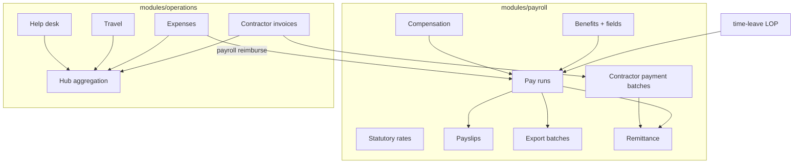

# Phase 2 — Full Operations Design

**Date:** 10 July 2026  
**Status:** Approved  
**Product:** Polaris (Digitaro HRMS)

## Goal

Deliver Phase 2 go-live gate: Finance export packs; contractor invoices end-to-end; payroll calculation approved by Finance. Cover all `tasks.md` §2.x items via four waves.

## Constraints

- Specs: `docs/` only (PRD §6.9–6.21, FLW-PAY-*, FLW-OPS-*, database-design §3.5–3.6, api-specification §4.11+)
- No Xero API — PDF/Excel export packs only
- No hard-coded country branches — statutory rates + config tables
- Every mutation → append-only `audit_log`
- Compensation/bank field redaction by role
- English UI only (`locales/en.json`)
- Phase 0/1 modules remain; new code in `payroll` + extend `operations` / `talent` / `compliance` / `country-config`

## Architecture

## Waves

| Wave | Scope | Exit criteria |
|---|---|---|
| **1** | Benefits, compensation, statutory rates, pay run calc/approve, payslips, export packs, Finance UI | Finance: create → calculate → approve → export |
| **2** | Contractor portal + invoices, payment batches, remittance (FLW-PAY-005) | Contractor paid E2E + remittance ZIP |
| **3** | Expenses, travel, help desk + Hub | Ops workflows live |
| **4** | FX UI, talent gaps, enterprise gov (HRBP, bulk import, access review, DSAR) | Phase 2 quality gate |

## Module boundaries

| Module | Owns |
|---|---|
| `payroll` | pay_components, compensation_records, benefit_* (migrate from country-config seed entity), statutory_*, pay_runs*, payslips, export_batches, remittance_*, contractor_payment_* |
| `operations` | contractor_invoices*, expense_*, travel_*, help_desk_*, Hub item types |
| `country-config` | FX catalog UI APIs, currency reporting helpers |
| `talent` | recruitment, training, manpower, IPMS gaps |
| `compliance` | HRBP role/scope, access review, DSAR export |
| `core-hr` | Bulk worker import job |

## Pay run state machine

`draft` → `review` → `approved` → `exported` → `locked`

- Calculate only from `draft`/`review`
- Approve is idempotent (same actor re-approve no-op)
- Export requires `approved`
- Lock after export (no further edits)

## Calculation (config-driven)

Inputs per period: active workers in legal entity/country, compensation + cash benefits, LOP from attendance/unpaid leave, pro-ration join/leave, one-off adjustments, expenses marked reimburse-via-payroll.

Statutory: lookup `statutory_rate_schedules` + `entries` by `legal_entity_id` + `country_code` + effective date. Rate keys (e.g. `eobi_employee`, `cpf_employer`) applied by generic engine — no `if (country === 'PK')`.

Anomalies: zero net, missing bank, variance vs prior period > threshold.

## Frontend surfaces

| Route | Role |
|---|---|
| `finance/pay-runs`, `finance/benefits`, `finance/statutory-rates`, `finance/exports` | Finance |
| `employee/payslips` | Employee |
| `contractor/*` (4 tabs) | Contractor |
| `employee/expenses`, `employee/travel`, `employee/help` | Employee |
| `people-ops/recruitment`, training, manpower | People Ops |

## Compliance map

| Flow | Wave |
|---|---|
| FLW-PAY-001 Employee pay run | 1 |
| FLW-PAY-003 Statutory rates | 1 |
| FLW-PAY-002 Contractor batch | 2 |
| FLW-PAY-005 Remittance | 2 |
| FLW-OPS-004 Contractor invoice | 2 |
| FLW-OPS-001/002/003 | 3 |
| FLW-PAY-004 Currency | 4 |
| FLW-TAL-001/005, manpower | 4 |

## Out of scope (explicit exclusions)

Xero API, Capacitor, non-English UI, QES, statutory remittance portals, WhatsApp Business API.

## Execution

1. Wave plans under `docs/superpowers/plans/`
2. Subagent-driven development per task (`polaris-backend` / `polaris-frontend`)
3. Spec + quality review after each task
4. Check off `docs/generated/tasks.md` only when verified
