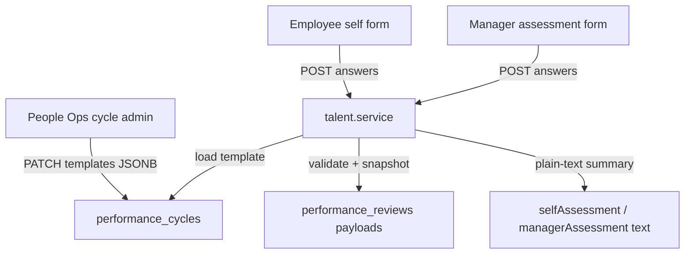

# Design: Review Assessment Questionnaires

**Date:** 2026-08-10  
**Status:** Implemented  
**Product:** Polaris (Digitaro HRMS)  
**Plan:** [../plans/2026-08-10-review-assessment-questionnaire.md](../plans/2026-08-10-review-assessment-questionnaire.md)  
**Related:** US-TAL-004 / FR-TAL-005, IPMS e2e design `2026-08-09-ipms-end-to-end-design.md`, pulse survey JSONB questions pattern, `performance_cycles` / `performance_reviews`

## Problem

Self-assessment (and manager assessment) on performance reviews is a single free-text field. People Ops cannot configure structured questions per cycle. Employees and managers cannot answer ratings, yes/no, or multiple-choice prompts that Digitaro needs for consistent reviews.

## Goals

1. People Ops configures **separate** self-assessment and manager-assessment questionnaires **per performance cycle**.
2. Full question types: short text, long text, rating, yes/no, single choice, multi-choice.
3. Templates remain editable anytime; each submission **snapshots** the question set so later edits do not rewrite past answers.
4. Submit is **blocked** when the relevant template is empty (no free-text fallback).
5. Preserve readable plain-text summaries on legacy review text columns for existing UIs (manager board, Hub snippets).

## Non-goals

- Peer-feedback questionnaires
- Shared form-template library / pulse survey refactor
- Analytics dashboards aggregating answer values
- Locking templates on cycle activation
- Free-text fallback when a template is empty
- Non-English UI / RTL

## Decisions (confirmed)

| Topic | Choice |
|---|---|
| Scope of config | Per performance cycle |
| Question types | Full: short/long text, rating, yes/no, single/multi choice |
| Self vs manager | Separate templates on the cycle |
| Edit policy | Editable anytime; answers store `questionsSnapshot` at submit |
| Empty template | Block submit until ≥1 question |
| Storage approach | JSONB on cycle + snapshotted JSONB payload on review (pulse-style) |

---

## 1. Data model

### `performance_cycles`

Add JSONB columns (default `[]`):

- `selfAssessmentTemplate: Question[]`
- `managerAssessmentTemplate: Question[]`

### `Question` shape

```ts
{
  id: string; // uuid, stable within template
  type: 'short_text' | 'long_text' | 'rating' | 'yes_no' | 'single_choice' | 'multi_choice';
  label: string;
  required: boolean;
  helpText?: string;
  scaleMin?: number; // rating
  scaleMax?: number; // rating
  options?: { id: string; label: string }[]; // choice types
}
```

### `performance_reviews`

Add nullable JSONB:

- `selfAssessmentPayload`
- `managerAssessmentPayload`

Payload shape:

```ts
{
  questionsSnapshot: Question[];
  answers: Record<string, string | number | boolean | string[]>; // keyed by questionId
}
```

Keep legacy `selfAssessment` / `managerAssessment` text columns. On successful submit, auto-fill a human-readable plain-text summary derived from answers (label → value lines) so existing surfaces keep working without parsing JSON.

### Snapshot rule

On submit, copy the **current** cycle template into `questionsSnapshot`. Subsequent template edits must not mutate stored payloads.

---

## 2. API

Extend existing `/api/v1/talent` routes (envelope `{ data, meta, errors }`; mutations → `audit_log`).

| Endpoint | Change |
|---|---|
| `POST/PATCH .../performance-cycles` | Accept/validate `selfAssessmentTemplate`, `managerAssessmentTemplate` |
| Cycle / dashboard / review reads | Return templates on cycle; payloads on review when present |
| `POST .../reviews/:id/self-assessment` | Body `{ answers }`; validate against cycle self template; write payload + text summary; advance status |
| `POST .../reviews/:id/manager-assessment` | Same for manager template / payload / summary |

### Validation (server)

- Reject submit if relevant template length is `0`
- Required questions must have answers
- Type checks: rating in `[scaleMin, scaleMax]`; choice ids must exist in options; multi_choice is `string[]`
- Unknown `questionId` keys → `400` (no silent drop)
- Existing RBAC / status / assignee checks unchanged (`403` / `409`)

---

## 3. UX

### People Ops — cycle admin

On cycle create/edit: two question builders (**Self-assessment**, **Manager assessment**).

Per question: type, label, required, help text; options or scale as needed; reorder; add/remove.

Warn when a template is empty: employees/managers cannot submit until at least one question exists.

Copy: English only (`frontend/src/locales/en.json`).

### Employee — self-assessment

Dialog renders the cycle self template as a dynamic form (not a single textarea). Submit disabled when template empty, with message to contact People Ops.

### Manager — manager assessment

Show employee’s snapshotted Q&A (read-only). Render manager template form. Same empty-template rule.

### Five UI states

Loading (skeleton), empty-template message, field/inline errors, offline/error toast, success (close + StatusTracker advances).

---

## 4. Error handling

| Case | Behavior |
|---|---|
| Empty template on submit | `400` |
| Missing required / bad type / unknown id | `400` with field-level detail by `questionId` |
| Invalid template shape on cycle PATCH | `400` |
| Wrong status / not assignee | existing `403` / `409` |

---

## 5. Testing & demo

- Unit: answer validation + summary derivation + snapshot copy
- Service: empty template rejected; post-submit template edit does not alter payload
- DTO/API: cycle PATCH templates; self/manager assessment body shape
- Frontend: render by type; submit payload; empty-template UX
- Seeds: demo cycle includes both templates so employee/manager demo accounts can complete assessments

---

## 6. Architecture sketch



---

## 7. Rollout notes

- Migration adds columns with safe defaults (`[]` / null).
- Existing reviews with only text remain readable; new submits use payloads.
- Demo seed update required so IPMS demos are not blocked by empty-template rule.
